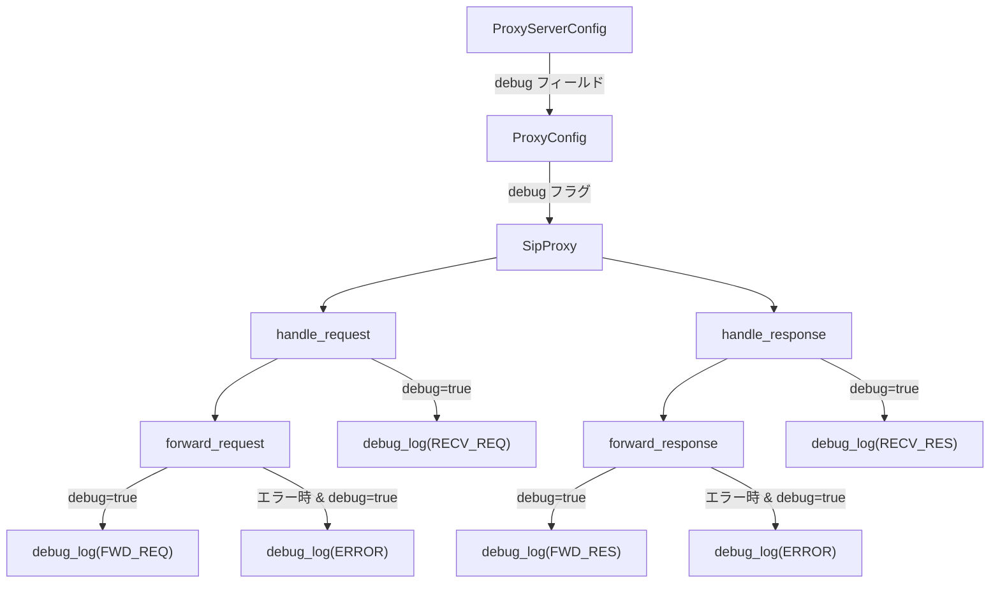

# プロキシデバッグログ機能

## はじめに

SIPロードテスターの性能測定において、success_calls と failed_calls がともにゼロになる問題が発生しています。原因を特定するために、SIPプロキシにデバッグログ機能を追加します。デバッグモードが有効な場合にのみ、リクエスト・レスポンスの転送状況を詳細にログ出力し、メッセージフローの追跡を可能にします。

### 概要

SIPプロキシにデバッグログ機能を追加し、リクエスト・レスポンスの転送フローを可視化します。`ProxyServerConfig` に `debug` フィールドを追加し、有効時のみ構造化されたデバッグログを stderr に出力します。

デバッグログは `[DEBUG]` プレフィックスとイベント種別（`RECV_REQ`, `FWD_REQ`, `RECV_RES`, `FWD_RES`, `ERROR`）を含み、メソッド名・ステータスコード・Call-ID・転送先アドレスなどの情報を出力します。

デバッグモードが無効の場合、ログ出力処理は一切実行されません。

## 用語集

- **Proxy**: SIPメッセージを中継するステートレスSIPプロキシ (`SipProxy` 構造体)
- **ProxyServerConfig**: プロキシバイナリ専用の設定構造体 (`src/config/mod.rs` の `ProxyServerConfig`)
- **Debug_Mode**: デバッグログの出力を制御するブール値の設定フラグ
- **Debug_Logger**: デバッグモードが有効な場合にのみログを出力するコンポーネント
- **Request**: UAC または UAS から受信した SIP リクエストメッセージ
- **Response**: UAS または UAC から受信した SIP レスポンスメッセージ
- **Forward_Destination**: リクエストまたはレスポンスの転送先ソケットアドレス

## アーキテクチャ

デバッグログ機能は、既存の `SipProxy` に `debug` フラグを追加し、各処理ポイントに条件付きログ出力を挿入する形で実装します。



設計方針:
- 新しいモジュールやトレイトは導入せず、`ProxyConfig` に `debug: bool` を追加
- ログ出力は `eprintln!` マクロで stderr に直接出力（外部ログクレート不使用）
- ログフォーマット関数を純粋関数として切り出し、テスト容易性を確保
- `SipProxy` の各メソッド内で `if self.config.debug { ... }` による条件分岐

## 要件

### 要件1: デバッグモード設定

**ユーザストーリー:** 開発者として、プロキシの設定ファイルでデバッグモードを有効・無効に切り替えたい。必要な時だけデバッグログを出力できるようにするため。

#### 受入基準

1. THE ProxyServerConfig SHALL `debug` フィールド（ブール型）を持つ
2. WHEN `debug` フィールドが設定ファイルに含まれない場合, THE ProxyServerConfig SHALL デフォルト値として `false` を使用する
3. WHEN `debug` フィールドが `true` に設定されている場合, THE Proxy SHALL デバッグログ出力を有効にする
4. WHEN `debug` フィールドが `false` に設定されている場合, THE Proxy SHALL デバッグログを出力しない

### 要件2: 受信リクエストのデバッグログ

**ユーザストーリー:** 開発者として、プロキシが受信したリクエストの詳細をログで確認したい。リクエストがプロキシに到達しているか確認できるようにするため。

#### 受入基準

1. WHILE Debug_Mode が有効, WHEN Proxy が Request を受信した場合, THE Debug_Logger SHALL リクエストのメソッド名、Request-URI、送信元アドレスをログ出力する
2. WHILE Debug_Mode が有効, WHEN Proxy が Request を受信した場合, THE Debug_Logger SHALL リクエストの Call-ID ヘッダをログ出力する

### 要件3: リクエスト転送のデバッグログ

**ユーザストーリー:** 開発者として、プロキシがリクエストを転送する際の宛先情報をログで確認したい。リクエストが正しい宛先に転送されているか確認できるようにするため。

#### 受入基準

1. WHILE Debug_Mode が有効, WHEN Proxy が Request を転送する場合, THE Debug_Logger SHALL 転送先の Forward_Destination をログ出力する
2. WHILE Debug_Mode が有効, WHEN Proxy が Request を転送する場合, THE Debug_Logger SHALL リクエストのメソッド名と Call-ID をログ出力する

### 要件4: 受信レスポンスのデバッグログ

**ユーザストーリー:** 開発者として、プロキシが受信したレスポンスの詳細をログで確認したい。レスポンスがプロキシに到達しているか確認できるようにするため。

#### 受入基準

1. WHILE Debug_Mode が有効, WHEN Proxy が Response を受信した場合, THE Debug_Logger SHALL レスポンスのステータスコード、理由フレーズ、送信元アドレスをログ出力する
2. WHILE Debug_Mode が有効, WHEN Proxy が Response を受信した場合, THE Debug_Logger SHALL レスポンスの Call-ID ヘッダをログ出力する

### 要件5: レスポンス転送のデバッグログ

**ユーザストーリー:** 開発者として、プロキシがレスポンスを転送する際の宛先情報をログで確認したい。レスポンスが正しい宛先（UAC）に転送されているか確認できるようにするため。

#### 受入基準

1. WHILE Debug_Mode が有効, WHEN Proxy が Response を転送する場合, THE Debug_Logger SHALL 転送先の Forward_Destination をログ出力する
2. WHILE Debug_Mode が有効, WHEN Proxy が Response を転送する場合, THE Debug_Logger SHALL レスポンスのステータスコードと Call-ID をログ出力する

### 要件6: エラー発生時のデバッグログ

**ユーザストーリー:** 開発者として、プロキシでエラーが発生した際の詳細をログで確認したい。問題の原因を特定できるようにするため。

#### 受入基準

1. WHILE Debug_Mode が有効, IF Request の転送中にエラーが発生した場合, THEN THE Debug_Logger SHALL エラー内容、リクエストのメソッド名、Call-ID、転送先アドレスをログ出力する
2. WHILE Debug_Mode が有効, IF Response の転送中にエラーが発生した場合, THEN THE Debug_Logger SHALL エラー内容、レスポンスのステータスコード、Call-ID、転送先アドレスをログ出力する

### 要件7: デバッグログの出力形式

**ユーザストーリー:** 開発者として、デバッグログが構造化された形式で出力されてほしい。ログの解析が容易になるようにするため。

#### 受入基準

1. THE Debug_Logger SHALL 全てのログメッセージに `[DEBUG]` プレフィックスを付与する
2. THE Debug_Logger SHALL 全てのログメッセージにイベント種別（`RECV_REQ`, `FWD_REQ`, `RECV_RES`, `FWD_RES`, `ERROR`）を含める
3. THE Debug_Logger SHALL ログを標準エラー出力（stderr）に出力する

### 要件8: プロキシ起動時のデバッグモード表示

**ユーザストーリー:** 開発者として、プロキシ起動時にデバッグモードが有効かどうかを確認したい。ログ出力が期待通りに設定されているか確認できるようにするため。

#### 受入基準

1. WHEN Proxy が起動し Debug_Mode が有効な場合, THE Proxy SHALL 起動メッセージにデバッグモードが有効である旨を表示する

### 要件9: 設定のラウンドトリップ

**ユーザストーリー:** 開発者として、デバッグフィールドを含む設定がシリアライズ・デシリアライズで正しく保持されてほしい。設定の読み書きで情報が失われないようにするため。

#### 受入基準

1. FOR ALL 有効な ProxyServerConfig オブジェクト, JSON にシリアライズしてからデシリアライズした結果は元のオブジェクトと等価である（ラウンドトリップ特性）

## 設計

### コンポーネントとインターフェース

#### 1. ProxyServerConfig の拡張

`src/config/mod.rs` の `ProxyServerConfig` に `debug` フィールドを追加します。

```rust
#[derive(Debug, Clone, PartialEq, Serialize, Deserialize)]
#[serde(default)]
pub struct ProxyServerConfig {
    pub host: String,
    pub port: u16,
    pub forward_host: String,
    pub forward_port: u16,
    pub auth_enabled: bool,
    pub auth_realm: String,
    pub users_file: Option<String>,
    pub debug: bool,  // 新規追加
}
```

`Default` 実装で `debug: false` を設定し、`#[serde(default)]` により設定ファイルに含まれない場合は `false` になります。

#### 2. ProxyConfig の拡張

`src/proxy/mod.rs` の `ProxyConfig` に `debug` フィールドを追加します。

```rust
#[derive(Debug, Clone)]
pub struct ProxyConfig {
    pub host: String,
    pub port: u16,
    pub forward_addr: SocketAddr,
    pub domain: String,
    pub debug: bool,  // 新規追加
}
```

#### 3. デバッグログフォーマット関数

`src/proxy/mod.rs` にログメッセージをフォーマットする純粋関数群を追加します。これらは `String` を返すだけで、出力先には依存しません。

```rust
/// デバッグログのイベント種別
enum DebugEvent {
    RecvReq,
    FwdReq,
    RecvRes,
    FwdRes,
    Error,
}

impl DebugEvent {
    fn label(&self) -> &'static str {
        match self {
            DebugEvent::RecvReq => "RECV_REQ",
            DebugEvent::FwdReq => "FWD_REQ",
            DebugEvent::RecvRes => "RECV_RES",
            DebugEvent::FwdRes => "FWD_RES",
            DebugEvent::Error => "ERROR",
        }
    }
}

/// リクエスト受信ログのフォーマット
fn format_recv_req_log(method: &str, request_uri: &str, from: SocketAddr, call_id: &str) -> String

/// リクエスト転送ログのフォーマット
fn format_fwd_req_log(method: &str, call_id: &str, dest: SocketAddr) -> String

/// レスポンス受信ログのフォーマット
fn format_recv_res_log(status_code: u16, reason: &str, from: SocketAddr, call_id: &str) -> String

/// レスポンス転送ログのフォーマット
fn format_fwd_res_log(status_code: u16, call_id: &str, dest: SocketAddr) -> String

/// エラーログのフォーマット（リクエスト転送エラー）
fn format_req_error_log(error: &str, method: &str, call_id: &str, dest: SocketAddr) -> String

/// エラーログのフォーマット（レスポンス転送エラー）
fn format_res_error_log(error: &str, status_code: u16, call_id: &str, dest: SocketAddr) -> String
```

各関数は以下の形式の文字列を返します:
```
[DEBUG] RECV_REQ method=INVITE uri=sip:bob@example.com from=192.168.1.1:5060 call-id=abc123@host
[DEBUG] FWD_REQ method=INVITE call-id=abc123@host dest=10.0.0.1:5080
[DEBUG] RECV_RES status=200 reason=OK from=10.0.0.1:5080 call-id=abc123@host
[DEBUG] FWD_RES status=200 call-id=abc123@host dest=192.168.1.1:5060
[DEBUG] ERROR event=FWD_REQ error="connection refused" method=INVITE call-id=abc123@host dest=10.0.0.1:5080
[DEBUG] ERROR event=FWD_RES error="connection refused" status=200 call-id=abc123@host dest=192.168.1.1:5060
```

#### 4. SipProxy のログ出力ポイント

`SipProxy` の各メソッドにデバッグログ出力を挿入します:

| メソッド | イベント | タイミング |
|---------|---------|-----------|
| `handle_request()` | `RECV_REQ` | リクエスト受信直後 |
| `forward_request()` | `FWD_REQ` | 転送直前 |
| `forward_request()` | `ERROR` | 転送エラー時 |
| `handle_response()` | `RECV_RES` | レスポンス受信直後 |
| `forward_response()` | `FWD_RES` | 転送直前 |
| `forward_response()` | `ERROR` | 転送エラー時 |

#### 5. sip_proxy.rs バイナリの変更

`src/bin/sip_proxy.rs` で:
- `ProxyConfig` 構築時に `config.debug` を渡す
- 起動メッセージにデバッグモード状態を表示

### データモデル

#### ProxyServerConfig（変更）

| フィールド | 型 | デフォルト | 説明 |
|-----------|-----|----------|------|
| host | String | "127.0.0.1" | リッスンアドレス |
| port | u16 | 5060 | リッスンポート |
| forward_host | String | "127.0.0.1" | 転送先ホスト |
| forward_port | u16 | 5080 | 転送先ポート |
| auth_enabled | bool | false | 認証有効フラグ |
| auth_realm | String | "sip-proxy" | 認証レルム |
| users_file | Option\<String\> | None | ユーザファイルパス |
| **debug** | **bool** | **false** | **デバッグログ有効フラグ（新規）** |

#### ProxyConfig（変更）

| フィールド | 型 | 説明 |
|-----------|-----|------|
| host | String | リッスンアドレス |
| port | u16 | リッスンポート |
| forward_addr | SocketAddr | デフォルト転送先 |
| domain | String | 管理ドメイン |
| **debug** | **bool** | **デバッグログ有効フラグ（新規）** |

#### DebugEvent（新規）

```rust
enum DebugEvent {
    RecvReq,  // リクエスト受信
    FwdReq,   // リクエスト転送
    RecvRes,  // レスポンス受信
    FwdRes,   // レスポンス転送
    Error,    // エラー発生
}
```

#### ログ出力形式

全てのデバッグログは以下の形式に従います:
```
[DEBUG] <EVENT_TYPE> <key=value pairs>
```

キーバリューペアはイベント種別に応じて異なります（コンポーネントとインターフェース セクション参照）。

## 正確性プロパティ (Correctness Properties)

*プロパティとは、システムのすべての有効な実行において成り立つべき特性や振る舞いのことです。人間が読める仕様と機械的に検証可能な正しさの保証をつなぐ橋渡しの役割を果たします。*

プリワーク分析の結果、要件 2〜7 のログフォーマットに関する受入基準は、各フォーマット関数が任意の入力に対して必要な情報をすべて含むかどうかのプロパティとして統合できます。7.1（`[DEBUG]`プレフィックス）と 7.2（イベント種別）は各ログフォーマットプロパティに含めることで独立したプロパティとしては不要です。

### Property 1: 受信リクエストログに必要情報がすべて含まれる

*For any* メソッド名、Request-URI、送信元アドレス、Call-ID の組み合わせに対して、`format_recv_req_log` の出力は `[DEBUG]` プレフィックスで始まり、イベント種別 `RECV_REQ` を含み、メソッド名、Request-URI、送信元アドレス、Call-ID のすべてを含む

**Validates: Requirements 2.1, 2.2, 7.1, 7.2**

### Property 2: 転送リクエストログに必要情報がすべて含まれる

*For any* メソッド名、Call-ID、転送先アドレスの組み合わせに対して、`format_fwd_req_log` の出力は `[DEBUG]` プレフィックスで始まり、イベント種別 `FWD_REQ` を含み、メソッド名、Call-ID、転送先アドレスのすべてを含む

**Validates: Requirements 3.1, 3.2, 7.1, 7.2**

### Property 3: 受信レスポンスログに必要情報がすべて含まれる

*For any* ステータスコード、理由フレーズ、送信元アドレス、Call-ID の組み合わせに対して、`format_recv_res_log` の出力は `[DEBUG]` プレフィックスで始まり、イベント種別 `RECV_RES` を含み、ステータスコード、理由フレーズ、送信元アドレス、Call-ID のすべてを含む

**Validates: Requirements 4.1, 4.2, 7.1, 7.2**

### Property 4: 転送レスポンスログに必要情報がすべて含まれる

*For any* ステータスコード、Call-ID、転送先アドレスの組み合わせに対して、`format_fwd_res_log` の出力は `[DEBUG]` プレフィックスで始まり、イベント種別 `FWD_RES` を含み、ステータスコード、Call-ID、転送先アドレスのすべてを含む

**Validates: Requirements 5.1, 5.2, 7.1, 7.2**

### Property 5: エラーログに必要情報がすべて含まれる

*For any* エラー内容、メソッド名（またはステータスコード）、Call-ID、転送先アドレスの組み合わせに対して、`format_req_error_log` および `format_res_error_log` の出力は `[DEBUG]` プレフィックスで始まり、イベント種別 `ERROR` を含み、エラー内容、識別情報（メソッド名またはステータスコード）、Call-ID、転送先アドレスのすべてを含む

**Validates: Requirements 6.1, 6.2, 7.1, 7.2**

### Property 6: ProxyServerConfig のラウンドトリップ

*For any* 有効な ProxyServerConfig オブジェクト（`debug` フィールドを含む）に対して、JSON にシリアライズしてからデシリアライズした結果は元のオブジェクトと等価である

**Validates: Requirements 9.1**

## エラーハンドリング

### デバッグログ出力時のエラー

- デバッグログのフォーマットは純粋関数であり、パニックしない設計とします
- `eprintln!` による stderr 出力は失敗しても（パイプが壊れた場合など）、プロキシの本来の処理には影響を与えません
- Call-ID ヘッダが存在しない場合は `"<unknown>"` をデフォルト値として使用します

### 設定関連のエラー

- `debug` フィールドが不正な型（例: 文字列）で指定された場合、serde のデシリアライズエラーとして既存のエラーハンドリングで処理されます
- バリデーションの追加は不要です（`bool` 型のため無効な値は存在しません）

## テスト戦略

### テストファースト方針

プロジェクトの TDD 方針に従い、すべてのテストを実装コードより先に作成します。

### ユニットテスト

以下の具体的なケースをユニットテストで検証します:

1. `ProxyServerConfig` に `debug` フィールドが存在し、デフォルト値が `false` であること（Requirements 1.1, 1.2）
2. `debug: true` を含む JSON のデシリアライズが正しく動作すること（Requirements 1.1）
3. `debug` フィールドを含まない JSON のデシリアライズで `false` がデフォルトになること（Requirements 1.2）
4. 各フォーマット関数が期待される形式の文字列を返すこと（具体的な入力値での検証）
5. `debug: false` の場合にログ出力が行われないこと（Requirements 1.4）

### プロパティベーステスト

プロパティベーステストには `proptest` クレート（既にプロジェクトで使用中）を使用します。

各プロパティテストは最低 100 回のイテレーションで実行します。

各テストには以下の形式のタグコメントを付与します:
```
// Feature: proxy-debug-logging, Property N: <property_text>
```

各 Correctness Property は単一のプロパティベーステストで実装します:

- **Property 1**: 任意のメソッド名・URI・アドレス・Call-ID を生成し、`format_recv_req_log` の出力に全情報が含まれることを検証
- **Property 2**: 任意のメソッド名・Call-ID・アドレスを生成し、`format_fwd_req_log` の出力に全情報が含まれることを検証
- **Property 3**: 任意のステータスコード・理由フレーズ・アドレス・Call-ID を生成し、`format_recv_res_log` の出力に全情報が含まれることを検証
- **Property 4**: 任意のステータスコード・Call-ID・アドレスを生成し、`format_fwd_res_log` の出力に全情報が含まれることを検証
- **Property 5**: 任意のエラー内容・メソッド名（またはステータスコード）・Call-ID・アドレスを生成し、`format_req_error_log` / `format_res_error_log` の出力に全情報が含まれることを検証
- **Property 6**: 既存の `arb_proxy_server_config` ジェネレータを拡張して `debug` フィールドを含め、ラウンドトリップを検証（既存テストの拡張）

### テスト用ジェネレータ

`proptest` 用のジェネレータとして以下を使用・追加します:

- `arb_proxy_server_config()`: 既存ジェネレータに `debug: bool` を追加
- `arb_socket_addr()`: 既存ジェネレータを再利用
- SIP メソッド名、Call-ID、Request-URI、理由フレーズ、エラーメッセージ用のジェネレータ
