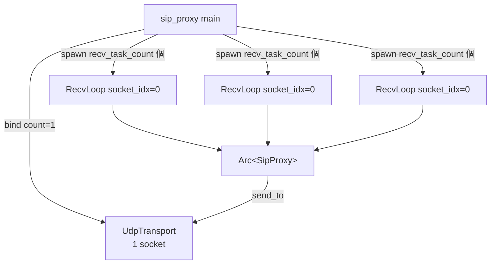
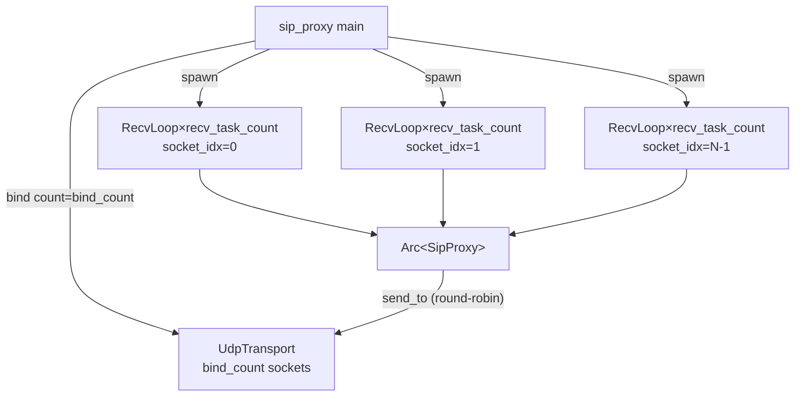

# プロキシ複数ソケット対応と RFC 3581 rport 対応

## はじめに

本ドキュメントは、SIP プロキシ（`src/bin/sip_proxy.rs`）の複数 UDP ソケット対応と RFC 3581 rport 対応の要件・設計・実装結果を定義する。

現在のプロキシは単一の UDP ソケット（`UdpTransport::bind` の `count=1`）で送受信を行っており、高負荷時に送信バッファが溢れて `EMSGSIZE` エラーが発生する（640 CPS でエラー率 48%）。受信ループの並列化（同一ソケットに対して複数の RecvLoop タスクを `tokio::spawn` で並列起動する方式）は完了済みだが、全ての受信タスクが同一ソケット（`socket_idx=0`）を使用しているため、単一ソケットの送信バッファがボトルネックとなっている。

本機能では以下の 2 つの課題を解決する:

1. **複数ソケットによる送信分散**: `UdpTransport::bind` の `count` パラメータを活用して複数の UDP ソケットを bind し、送信をラウンドロビンで分散させる。各ソケットで受信も待ち受けることで、送信バッファのボトルネックを解消する。
2. **RFC 3581 rport 対応**: 複数ソケットを使用すると、送信に使用したソケットのポートと受信待ち受けポートが異なる場合がある。RFC 3581 の rport メカニズムにより、対向（UAS）が Via ヘッダの rport パラメータを使って送信元ポートに返信できるようにする。

### 設計方針

- `UdpTransport::bind` の `count` パラメータに `bind_count` を渡し、複数ソケットを bind
- 各ソケットに `recv_task_count` 個の RecvLoop を割り当て（合計 `bind_count × recv_task_count` 個）
- 送信は既存のラウンドロビンで分散（`UdpTransport::send_to` の `AtomicUsize` を活用）
- Via ヘッダに `;rport` パラメータを挿入し、レスポンスルーティング時に `received`/`rport` パラメータを考慮

## 用語集

- **SipProxy**: SIP メッセージのルーティング・転送を行うプロキシサーバ。`Arc<SipProxy>` で複数タスクから共有される
- **UdpTransport**: UDP ソケットの送受信を管理するトランスポート層。`bind` の `count` パラメータで複数ソケットをサポートし、`send_to` はラウンドロビンで送信ソケットを選択する
- **RecvLoop**: UdpTransport の `recv_from` を呼び出し、受信データをパースして SipProxy に振り分ける非同期ループ
- **ProxyServerConfig**: SipProxy の動作設定を保持する構造体（`src/config/mod.rs`）
- **ProxyConfig**: SipProxy の内部設定を保持する構造体（`src/proxy/mod.rs`）
- **BindCount**: プロキシが bind する UDP ソケットの数を指定する設定値
- **SocketIdx**: 複数ソケットのうち、特定のソケットを識別するインデックス（0 始まり）
- **Via ヘッダ**: SIP メッセージの経路情報を記録するヘッダ。プロキシは転送時に自身の Via を追加し、レスポンス受信時に除去する
- **rport**: RFC 3581 で定義されたパラメータ。Via ヘッダに付与され、レスポンスの送信先ポートとして送信元の実際のポートを使用することを要求する
- **received パラメータ**: Via ヘッダの `received` パラメータ。送信元の実際の IP アドレスを記録する（RFC 3261）
- **CPS**: Calls Per Second。単位時間あたりの呼処理数

## アーキテクチャ

### 変更前



### 変更後



### 変更の範囲

| ファイル | 変更内容 |
|---|---|
| `src/config/mod.rs` | `ProxyServerConfig` に `bind_count` フィールド追加 |
| `src/bin/sip_proxy.rs` | `UdpTransport::bind` の `count` 引数を `bind_count` に変更、RecvLoop を `bind_count × recv_task_count` 個起動 |
| `src/proxy/mod.rs` | `build_via_value` に `;rport` 追加、`parse_via_addr` を `received`/`rport` パラメータ対応に拡張 |

### 設計判断

1. **送信ソケット選択はラウンドロビンのまま**: `UdpTransport::send_to` は既に `AtomicUsize` によるラウンドロビンを実装済み。`bind_count` を増やすだけで送信分散が実現されるため、新たなロジックは不要。
2. **RecvLoop の割り当て方式**: 各ソケットに `recv_task_count` 個の RecvLoop を割り当てる（合計 `bind_count × recv_task_count` 個）。これにより全ソケットで均等に受信処理が行われる。
3. **rport は値なしで挿入**: プロキシが Via に挿入する `rport` は値なし（`;rport`）。UAS 側が `rport=<実際のポート>` として値を埋める（RFC 3581 の仕様通り）。
4. **parse_via_addr の拡張**: 既存の `parse_via_addr` 関数を拡張し、`received` と `rport` パラメータを解析。パラメータが存在する場合はそれらの値を優先して `SocketAddr` を構成する。

## 要件

### 要件 1: 複数 UDP ソケットの bind

**ユーザストーリー:** システム管理者として、プロキシが複数の UDP ソケットを bind して送信を分散させたい。高負荷時の送信バッファ溢れを防ぎスループットが向上するため。

#### 受け入れ基準

1. SipProxy 起動時に、UdpTransport は `bind_count` で指定された数の UDP ソケットを連続ポートで bind する
2. UdpTransport は送信時にラウンドロビンで送信ソケットを選択する（既存の `send_to` の動作を活用）
3. SipProxy 起動時に、各ソケットに対して RecvLoop を起動し、全ソケットで受信を待ち受ける
4. RecvLoop は自身が担当する SocketIdx を使用して `recv_from` を呼び出す
5. 複数の RecvLoop が異なるソケットで同時に動作中、SipProxy は全ての RecvLoop から安全にメッセージ処理を実行できる

### 要件 2: bind_count の設定

**ユーザストーリー:** システム管理者として、bind するソケット数を設定ファイルで指定したい。環境に応じてソケット数を調整できるようにするため。

#### 受け入れ基準

1. `ProxyServerConfig` は `bind_count` フィールドを持ち、BindCount を指定できる
2. `bind_count` が設定ファイルで省略された場合、デフォルト値 4 を使用する
3. `bind_count` に 0 が指定された場合、バリデーションエラーを返す
4. 設定ファイル読み込み時、`bind_count` の値を正の整数として解釈する

### 要件 3: 受信タスクとソケットの対応

**ユーザストーリー:** 開発者として、各受信タスクが担当するソケットを明確に割り当てたい。全ソケットで漏れなく受信できるようにするため。

#### 受け入れ基準

1. SipProxy 起動時に、`bind_count` 個のソケットそれぞれに対して `recv_task_count` 個の RecvLoop を起動する（合計 `bind_count × recv_task_count` 個のタスク）
2. RecvLoop は割り当てられた SocketIdx を引数として受け取り、そのソケットからのみ受信する
3. シャットダウンシグナル受信時、SipProxy は全ての RecvLoop（`bind_count × recv_task_count` 個）の終了を待機してからプロセスを終了する

### 要件 4: Via ヘッダへの rport パラメータ挿入

**ユーザストーリー:** 開発者として、プロキシが転送するリクエストの Via ヘッダに rport パラメータを挿入したい。対向が送信元ポートに返信できるようにするため。

#### 受け入れ基準

1. SipProxy がリクエストを転送するとき、自身の Via ヘッダに `;rport` パラメータを付与する
2. Via ヘッダは `SIP/2.0/UDP {host}:{port};rport;branch=z9hG4bK-proxy-{random}` の形式で生成される
3. SipProxy は既存の Via ヘッダ生成ロジック（`build_via_value`）を拡張して rport パラメータを含める

### 要件 5: レスポンスルーティングにおける rport/received 対応

**ユーザストーリー:** 開発者として、レスポンスのルーティング時に Via ヘッダの rport と received パラメータを考慮したい。複数ソケット環境でレスポンスが正しい宛先に転送されるようにするため。

#### 受け入れ基準

1. レスポンス転送時に Via ヘッダに `received` パラメータが存在するとき、`received` の IP アドレスを転送先として使用する
2. レスポンス転送時に Via ヘッダに `rport` パラメータ（値付き）が存在するとき、`rport` のポート番号を転送先ポートとして使用する
3. Via ヘッダに `received` と `rport` の両方が存在するとき、`received` の IP アドレスと `rport` のポート番号を組み合わせた宛先に転送する
4. Via ヘッダに `received` も `rport` も存在しないとき、既存のロジック（Via ヘッダの host:port）を使用して転送先を決定する
5. `parse_via_addr` 関数は Via ヘッダから `received` パラメータと `rport` パラメータを解析し、存在する場合はそれらの値を優先して SocketAddr を返す

### 要件 6: Via ヘッダパラメータのパースとフォーマット

**ユーザストーリー:** 開発者として、Via ヘッダの rport/received パラメータを正確にパース・フォーマットしたい。RFC 3581 に準拠した動作を保証するため。

#### 受け入れ基準

1. `parse_via_addr` 関数は `;rport=<port>` 形式のパラメータからポート番号を抽出できる
2. `parse_via_addr` 関数は `;received=<ip>` 形式のパラメータから IP アドレスを抽出できる
3. `parse_via_addr` 関数は `;rport`（値なし）形式のパラメータを無視し、Via ヘッダの host:port を使用する
4. `parse_via_addr` 関数はパラメータの順序に依存せず正しく解析する
5. 有効な Via ヘッダ文字列に対して、`parse_via_addr` でパースした結果を Via ヘッダ文字列に再構成し、再度パースした結果は元のパース結果と一致する（ラウンドトリップ特性）

### 要件 7: 既存動作の互換性維持

**ユーザストーリー:** 開発者として、複数ソケット化と rport 対応後もプロキシの既存機能が正しく動作することを保証したい。リグレッションが発生しないため。

#### 受け入れ基準

1. 複数ソケット化前と同一の SIP メッセージルーティングロジックを維持する
2. REGISTER リクエストの処理（LocationService への登録と 200 OK 応答）を正しく実行する
3. Via ヘッダの追加・除去および Record-Route ヘッダの挿入を正しく実行する
4. `bind_count` が 1 に設定された場合、単一ソケット時と同一の動作をする
5. rport パラメータが存在しない Via ヘッダ（レガシーな対向からのレスポンス）を正しく処理する

### 要件 8: スループットの向上

**ユーザストーリー:** システム管理者として、複数ソケット化によりプロキシのスループットが向上することを確認したい。高負荷環境での運用に耐えられるようにするため。

#### 受け入れ基準

1. `bind_count` を 4 に設定してベンチマークを実行したとき、単一ソケット時と比較して最大安定 CPS が向上する
2. 高負荷（640 CPS 以上）でベンチマークを実行したとき、単一ソケット時と比較してエラー率が低減する

## コンポーネントとインターフェース

### 1. ProxyServerConfig（変更）

`src/config/mod.rs` の `ProxyServerConfig` 構造体に `bind_count` フィールドを追加。

```rust
pub struct ProxyServerConfig {
    // ... 既存フィールド ...
    pub recv_task_count: usize,
    #[serde(default = "default_bind_count")]
    pub bind_count: usize,
}
```

- デフォルト値: `4`
- バリデーション: `bind_count == 0` の場合エラー（`"bind_count must be greater than 0"`）

### 2. sip_proxy main（変更）

`src/bin/sip_proxy.rs` の `main` 関数を変更。

```rust
// 変更前
let transport = UdpTransport::bind(host, config.port, 1).await?;
// 変更後
let transport = UdpTransport::bind(host, config.port, config.bind_count as u16).await?;
```

RecvLoop の起動ロジック:

```rust
// 変更前: recv_task_count 個、全て socket_idx=0
for _ in 0..config.recv_task_count {
    handles.push(tokio::spawn(recv_loop(t, p, s, 0)));
}

// 変更後: bind_count × recv_task_count 個、各ソケットに recv_task_count 個
for socket_idx in 0..transport_for_recv.socket_count() {
    for _ in 0..config.recv_task_count {
        handles.push(tokio::spawn(recv_loop(t, p, s, socket_idx)));
    }
}
```

### 3. build_via_value（変更）

`src/proxy/mod.rs` の `SipProxy::build_via_value` メソッドに `;rport` を追加。

```rust
fn build_via_value(&self) -> String {
    let mut via = String::with_capacity(90);
    via.push_str("SIP/2.0/UDP ");
    via.push_str(&self.config.host);
    via.push(':');
    let _ = write!(via, "{}", self.config.port);
    via.push_str(";rport");  // 追加
    via.push_str(";branch=z9hG4bK-proxy-");
    via.push_str(&rand_branch());
    via
}
```

### 4. parse_via_addr（変更）

`src/proxy/mod.rs` の `parse_via_addr` 関数を拡張し、`received`/`rport` パラメータを解析。

```rust
fn parse_via_addr(via: &str) -> Option<SocketAddr> {
    let via = via.trim();
    let after_proto = via.split_whitespace().nth(1)?;
    let host_port = after_proto.split(';').next()?;
    let base_addr: SocketAddr = host_port.parse().ok()?;

    let mut received_ip: Option<IpAddr> = None;
    let mut rport_val: Option<u16> = None;

    for param in after_proto.split(';').skip(1) {
        let param = param.trim();
        if let Some(val) = param.strip_prefix("received=") {
            received_ip = val.parse().ok();
        } else if let Some(val) = param.strip_prefix("rport=") {
            rport_val = val.parse().ok();
        }
    }

    let ip = received_ip.unwrap_or(base_addr.ip());
    let port = rport_val.unwrap_or(base_addr.port());
    Some(SocketAddr::new(ip, port))
}
```

## データモデル

### ProxyServerConfig の変更

| フィールド | 型 | デフォルト | 説明 |
|---|---|---|---|
| `bind_count` | `usize` | `4` | プロキシが bind する UDP ソケット数 |

### Via ヘッダのフォーマット変更

| 項目 | 変更前 | 変更後 |
|---|---|---|
| Via 値 | `SIP/2.0/UDP {host}:{port};branch=z9hG4bK-proxy-{hex}` | `SIP/2.0/UDP {host}:{port};rport;branch=z9hG4bK-proxy-{hex}` |

### parse_via_addr の入出力

| 入力例 | 出力 |
|---|---|
| `SIP/2.0/UDP 10.0.0.1:5060;branch=z9hG4bK776` | `10.0.0.1:5060` |
| `SIP/2.0/UDP 10.0.0.1:5060;rport=5062;branch=z9hG4bK776` | `10.0.0.1:5062` |
| `SIP/2.0/UDP 10.0.0.1:5060;received=192.168.1.1;branch=z9hG4bK776` | `192.168.1.1:5060` |
| `SIP/2.0/UDP 10.0.0.1:5060;received=192.168.1.1;rport=5062;branch=z9hG4bK776` | `192.168.1.1:5062` |
| `SIP/2.0/UDP 10.0.0.1:5060;rport;branch=z9hG4bK776` | `10.0.0.1:5060`（rport 値なしは無視） |

## 正当性プロパティ

### Property 1: bind_count 個のソケットが生成される

任意の正の整数 `bind_count` に対して、`UdpTransport::bind(addr, port, bind_count)` を呼び出した結果の `socket_count()` は `bind_count` と等しい。

### Property 2: ProxyServerConfig の serde ラウンドトリップ

任意の有効な `ProxyServerConfig`（`bind_count` フィールドを含む）に対して、JSON にシリアライズしてからデシリアライズした結果は元の値と等しい。

### Property 3: Via ヘッダに rport パラメータが含まれる

任意の `ProxyConfig`（任意の host, port）に対して、`build_via_value` が生成する Via ヘッダ文字列は `SIP/2.0/UDP {host}:{port};rport;branch=z9hG4bK-proxy-` のプレフィックスを持つ。

### Property 4: parse_via_addr が received/rport パラメータを正しく解決する

任意の有効な IP アドレス、ポート、オプショナルな received IP、オプショナルな rport 値から構成された Via ヘッダ文字列に対して、`parse_via_addr` は `received` が存在すればその IP、なければ base IP を使用し、`rport=<値>` が存在すればその値、なければ base port を使用した `SocketAddr` を返す。

### Property 5: parse_via_addr はパラメータの順序に依存しない

任意の有効な Via ヘッダのパラメータ集合に対して、パラメータの順序を入れ替えた Via ヘッダ文字列を `parse_via_addr` でパースした結果は、元の順序でパースした結果と等しい。

### Property 6: Via ヘッダのパース・ラウンドトリップ

任意の有効な Via ヘッダ文字列に対して、`parse_via_addr` でパースした `SocketAddr` を使って Via ヘッダ文字列を再構成し、再度 `parse_via_addr` でパースした結果は、最初のパース結果と等しい。

## エラーハンドリング

### 設定エラー

| エラー条件 | 処理 |
|---|---|
| `bind_count` が 0 | `ProxyServerConfig::validate()` がエラーメッセージを返す。プロセス起動前に検出。 |
| `bind_count` が負数 | `usize` 型のため、JSON デシリアライズ時に serde がエラーを返す。 |
| ソケット bind 失敗 | `UdpTransport::bind` が `SipLoadTestError` を返す。`main` でキャッチしてプロセス終了。 |
| 連続ポートが使用中 | `UdpTransport::bind` 内の `UdpSocket::bind` が IO エラーを返す。 |

### Via ヘッダパースエラー

| エラー条件 | 処理 |
|---|---|
| `received` の値が不正な IP | `parse` が失敗し、`received` パラメータを無視（base IP を使用） |
| `rport` の値が不正なポート番号 | `parse` が失敗し、`rport` パラメータを無視（base port を使用） |
| Via ヘッダ全体が不正 | `parse_via_addr` が `None` を返し、既存のフォールバック（`forward_addr`）を使用 |

## テスト戦略

### ユニットテスト

- `ProxyServerConfig` の `bind_count` デフォルト値テスト
- `ProxyServerConfig` の `bind_count` が 0 の場合のバリデーションエラーテスト
- `ProxyServerConfig` の `bind_count` が JSON で省略された場合のデフォルト値テスト
- `build_via_value` が `;rport` を含む Via ヘッダを生成するテスト
- `parse_via_addr` の `received` パラメータ解析テスト
- `parse_via_addr` の `rport=<値>` パラメータ解析テスト
- `parse_via_addr` の `received` + `rport` 両方存在するケースのテスト
- `parse_via_addr` の `rport`（値なし）を無視するテスト
- `parse_via_addr` のパラメータなし（既存動作）テスト
- `bind_count=1` の後方互換性テスト

### プロパティベーステスト

プロパティベーステストには `proptest` クレートを使用。各テストは最低 100 回のイテレーションで実行。

| Property | テスト内容 | ジェネレータ |
|---|---|---|
| Property 1 | `UdpTransport::bind` のソケット数検証 | `1u16..=8`（bind_count） |
| Property 2 | `ProxyServerConfig` の serde ラウンドトリップ | 既存の `arb_proxy_server_config` を拡張 |
| Property 3 | `build_via_value` の Via フォーマット検証 | `arb_host`, `arb_port` |
| Property 4 | `parse_via_addr` の received/rport 解決 | `arb_ip`, `arb_port`, `Option<arb_ip>`, `Option<arb_port>` |
| Property 5 | `parse_via_addr` のパラメータ順序非依存 | Property 4 と同じ + パラメータ順序のシャッフル |
| Property 6 | Via ヘッダのパース・ラウンドトリップ | `arb_via_value`（received/rport パラメータ付き） |
