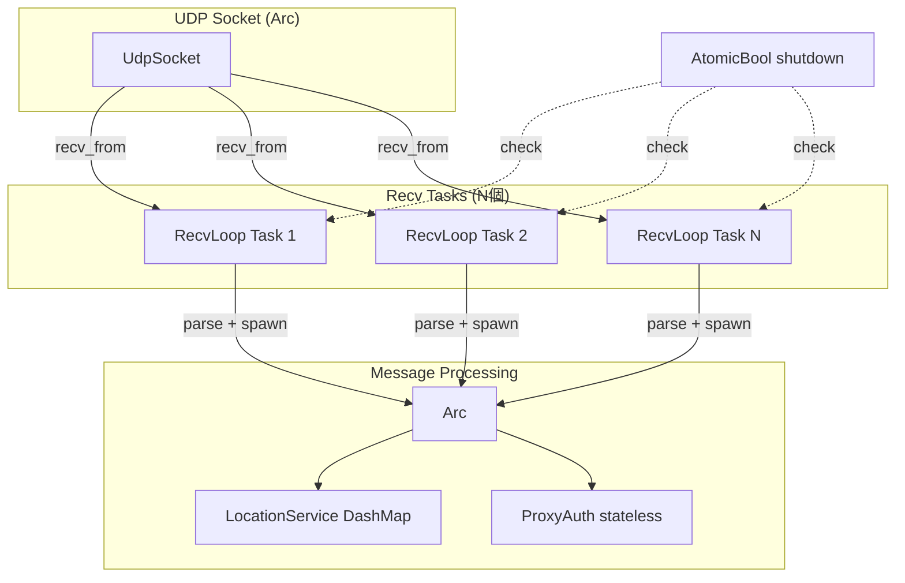

# プロキシ受信ループ並列化

## はじめに

本ドキュメントは、SIP プロキシ（`src/bin/sip_proxy.rs`）の受信ループを複数の非同期タスクで並列化する機能の要件・設計・実装結果を定義する。

現在のプロキシは単一の受信ループ（`recv_from` → パース → `tokio::spawn`）で全トラフィックを処理しており、高負荷時にボトルネックとなっている。ベンチマーク結果では 320 CPS → 640 CPS でエラー率が 0% → 48% に急増しており、受信ループの並列化によりこのボトルネックを解消する。

### 概要

本設計では、同一の UDP ソケットに対して N 個の受信ループタスクを `tokio::spawn` で並列起動する。`UdpTransport`（内部で `tokio::net::UdpSocket` を使用）の `recv_from` は `&self` で呼び出し可能であり、Tokio の `UdpSocket::recv_from` は複数タスクからの同時呼び出しに対応している。`SipProxy` も `Arc<SipProxy>` で共有可能な設計であるため、追加のロック機構は不要である。

### 設計方針

- 既存の受信ループロジックをそのまま関数に抽出し、N 回 spawn する
- `ProxyServerConfig` に `recv_task_count` フィールドを追加（デフォルト 4）
- シャットダウンは既存の `AtomicBool` フラグで全タスクに通知
- `JoinHandle` を保持し、全タスクの終了を `await` してからプロセスを終了

## 用語集

- **SipProxy**: SIP メッセージのルーティング・転送を行うプロキシサーバ。`Arc<SipProxy>` で複数タスクから共有される
- **UdpTransport**: UDP ソケットの送受信を管理するトランスポート層。`Arc<UdpTransport>` で複数タスクから共有可能
- **RecvLoop**: UdpTransport の `recv_from` を呼び出し、受信データをパースして SipProxy に振り分ける非同期ループ
- **RecvTaskCount**: 並列実行する RecvLoop の数を指定する設定値
- **LocationService**: SIP REGISTER で登録された AOR とコンタクト情報のマッピングを管理するサービス。DashMap ベースで並行安全
- **CPS**: Calls Per Second。単位時間あたりの呼処理数

## アーキテクチャ



### 処理フロー

1. `ProxyServerConfig` から `recv_task_count` を読み取る
2. `Arc<UdpTransport>` と `Arc<SipProxy>` を生成
3. `recv_task_count` 個の受信ループタスクを `tokio::spawn` で起動
4. 各タスクは独立して `recv_from` → パース → `tokio::spawn`（メッセージ処理）を実行
5. シャットダウンシグナル受信時、`AtomicBool` を `true` に設定
6. 各受信ループはタイムアウト後にフラグを検出してループを終了
7. メインタスクは全 `JoinHandle` を `join_all` で待機してから終了

### 並行安全性

| コンポーネント | 共有方法 | 安全性の根拠 |
|---|---|---|
| `UdpTransport` | `Arc<UdpTransport>` | `recv_from` は `&self` で呼び出し可能。Tokio の `UdpSocket` は内部で適切に同期される |
| `SipProxy` | `Arc<SipProxy>` | 全フィールドが `Send + Sync`（テストで検証済み） |
| `LocationService` | `Arc<LocationService>` 内の `DashMap` | `DashMap` は並行安全なハッシュマップ |
| `ProxyAuth` | `SipProxy` 内の `Option<ProxyAuth>` | ステートレスな認証処理 |
| `UserPool` | `Arc<UserPool>` | 読み取り専用 |
| shutdown フラグ | `Arc<AtomicBool>` | アトミック操作で安全 |

## 要件

### 要件 1: 受信ループの並列タスク化

**ユーザストーリー:** システム管理者として、プロキシの受信ループを複数タスクで並列実行したい。高負荷時のスループットが向上し、エラー率が低減するため。

#### 受け入れ基準

1. SipProxy 起動時に、同一の UDP ソケットに対して RecvTaskCount 個の RecvLoop を並列に起動する
2. 各 RecvLoop は独立した非同期タスクとして `tokio::spawn` で実行される
3. 複数の RecvLoop が同時に動作中、`Arc<UdpTransport>` を介して全 RecvLoop から安全に `recv_from` を呼び出せる
4. 複数の RecvLoop が同時に動作中、`Arc<SipProxy>` を介して全 RecvLoop から安全にメッセージ処理を実行できる
5. RecvLoop は受信データを SIP メッセージとしてパースし、リクエストとレスポンスを SipProxy に振り分ける（既存の処理フローを維持）

### 要件 2: 受信タスク数の設定

**ユーザストーリー:** システム管理者として、受信タスク数を設定ファイルで指定したい。環境に応じて並列度を調整できるようにするため。

#### 受け入れ基準

1. `ProxyServerConfig` は `recv_task_count` フィールドを持ち、RecvTaskCount を指定できる
2. `recv_task_count` が設定ファイルで省略された場合、デフォルト値 4 を使用する
3. `recv_task_count` に 0 が指定された場合、バリデーションエラーを返す
4. 設定ファイル読み込み時、`recv_task_count` の値を正の整数として解釈する

### 要件 3: シャットダウンの協調動作

**ユーザストーリー:** システム管理者として、シャットダウン時に全ての受信タスクが正常に停止してほしい。プロセスが確実に終了するため。

#### 受け入れ基準

1. シャットダウンシグナル（SIGINT/SIGTERM）受信時、全ての RecvLoop に停止を通知する
2. 停止通知を受けた RecvLoop は、現在処理中のメッセージの完了後に受信ループを終了する
3. SipProxy は全ての RecvLoop が終了するまで待機してからプロセスを終了する

### 要件 4: 既存動作の互換性維持

**ユーザストーリー:** 開発者として、並列化後もプロキシの既存機能が正しく動作することを保証したい。リグレッションが発生しないため。

#### 受け入れ基準

1. 並列化前と同一の SIP メッセージルーティングロジックを維持する
2. REGISTER リクエストの処理（LocationService への登録と 200 OK 応答）を正しく実行する
3. 認証処理（ProxyAuth による 407/401 応答）を正しく実行する
4. Via ヘッダの追加・除去および Record-Route ヘッダの挿入を正しく実行する
5. 複数の RecvLoop が同時に REGISTER リクエストを処理している間、LocationService のデータ整合性を維持する

### 要件 5: スループットの向上

**ユーザストーリー:** システム管理者として、並列化によりプロキシのスループットが向上することを確認したい。高負荷環境での運用に耐えられるようにするため。

#### 受け入れ基準

1. RecvTaskCount を 4 に設定してベンチマークを実行したとき、単一受信ループ時と比較して最大安定 CPS が向上する
2. 高負荷（640 CPS 以上）でベンチマークを実行したとき、単一受信ループ時と比較してエラー率が低減する

## コンポーネントとインターフェース

### 変更対象コンポーネント

#### 1. `ProxyServerConfig`（src/config/mod.rs）

`recv_task_count` フィールドを追加。

```rust
pub struct ProxyServerConfig {
    // ... 既存フィールド ...
    #[serde(default = "default_recv_task_count")]
    pub recv_task_count: usize,
}

fn default_recv_task_count() -> usize {
    4
}
```

バリデーション: `recv_task_count == 0` の場合はエラーを返す。

#### 2. 受信ループ関数の抽出（src/bin/sip_proxy.rs）

`main` 関数内にインラインで記述されていた受信ループを、独立した非同期関数として抽出。

```rust
async fn recv_loop(
    transport: Arc<UdpTransport>,
    proxy: Arc<SipProxy>,
    shutdown: Arc<AtomicBool>,
    socket_idx: usize,
) {
    loop {
        if shutdown.load(Ordering::SeqCst) {
            break;
        }
        let recv_result = tokio::time::timeout(
            Duration::from_millis(100),
            transport.recv_from(socket_idx),
        ).await;
        // ... パース・振り分け処理（既存ロジックと同一）...
    }
}
```

#### 3. メイン関数の変更（src/bin/sip_proxy.rs）

```rust
let mut handles = Vec::new();
for _ in 0..config.recv_task_count {
    let t = transport_for_recv.clone();
    let p = proxy.clone();
    let s = shutdown.clone();
    handles.push(tokio::spawn(recv_loop(t, p, s, 0)));
}
futures::future::join_all(handles).await;
```

### 変更しないコンポーネント

- `SipProxy`（src/proxy/mod.rs）: 既に `Arc` で共有可能
- `UdpTransport`（src/transport/mod.rs）: `recv_from` は `&self`
- `LocationService`: `DashMap` ベースで並行安全
- `ProxyAuth`: ステートレス

## 正当性プロパティ

### Property 1: 受信タスク数が設定値と一致する

任意の正の整数 `recv_task_count` を持つ `ProxyServerConfig` に対して、受信ループの起動時に生成される `JoinHandle` の数は `recv_task_count` と等しくなければならない。

### Property 2: 複数タスクからの同時 recv_from 呼び出しの安全性

任意の正の整数 N に対して、N 個のタスクが同一の `Arc<UdpTransport>` に対して同時に `recv_from` を呼び出した場合、パニックやデータ破損が発生してはならない。

### Property 3: ProxyServerConfig の recv_task_count ラウンドトリップ

任意の有効な `ProxyServerConfig`（`recv_task_count > 0`）に対して、JSON にシリアライズしてからデシリアライズした結果は、元の `recv_task_count` の値を保持しなければならない。

### Property 4: シャットダウンによる全タスクの終了

任意の正の `recv_task_count` に対して、シャットダウンフラグ（`AtomicBool`）を `true` に設定した後、全ての受信ループタスクが終了し、`join_all` が完了しなければならない。

### Property 5: 並行 REGISTER 処理における LocationService の整合性

任意の AOR とコンタクト情報のセットに対して、複数タスクから同時に `LocationService::register` を呼び出した後、各 AOR に対する `lookup` は有効なコンタクト情報を返さなければならない。

## ベンチマーク結果

### 条件

- `recv_task_count`: 4（デフォルト）
- `auth_enabled`: true
- `uac_port_count`: 4, `uas_port_count`: 4
- binary-search モード（各ステップ 15 秒）

### 結果

| 指標 | 値 |
|---|---|
| 最大安定 CPS | 335.0 |
| BHCA 換算 | 約 1,206,000 |
| 総コール数 | 52,692 |
| 成功コール数 | 44,391 |
| 失敗コール数 | 8,301 |
| 認証エラー | 0 |

### 640 CPS 時のエラー率

| recv_task_count | エラー率 |
|---|---|
| 4 | 47.90% |
| 32 | 47.99% |

### 分析

受信ループの並列化は正しく動作しているが、現在のボトルネックは送信側の UDP ソケットバッファ溢れ（`EMSGSIZE: Message too long`）にある。プロキシは単一ソケット（`bind count=1`）で送受信しており、高負荷時に送信バッファが飽和する。`recv_task_count` を増やしても CPS は変わらない。

次のステップとして、プロキシ側の複数ソケット対応（`proxy-multi-socket-rport`）で送信を分散させる必要がある。
