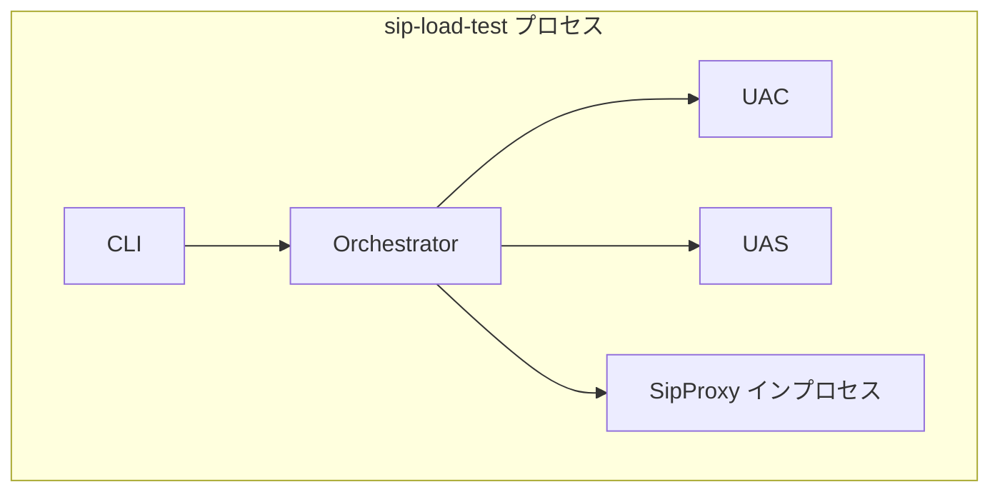
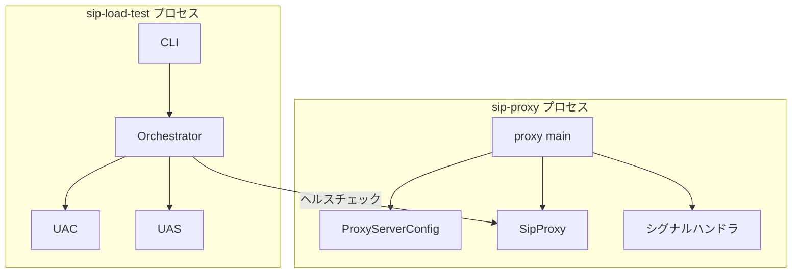
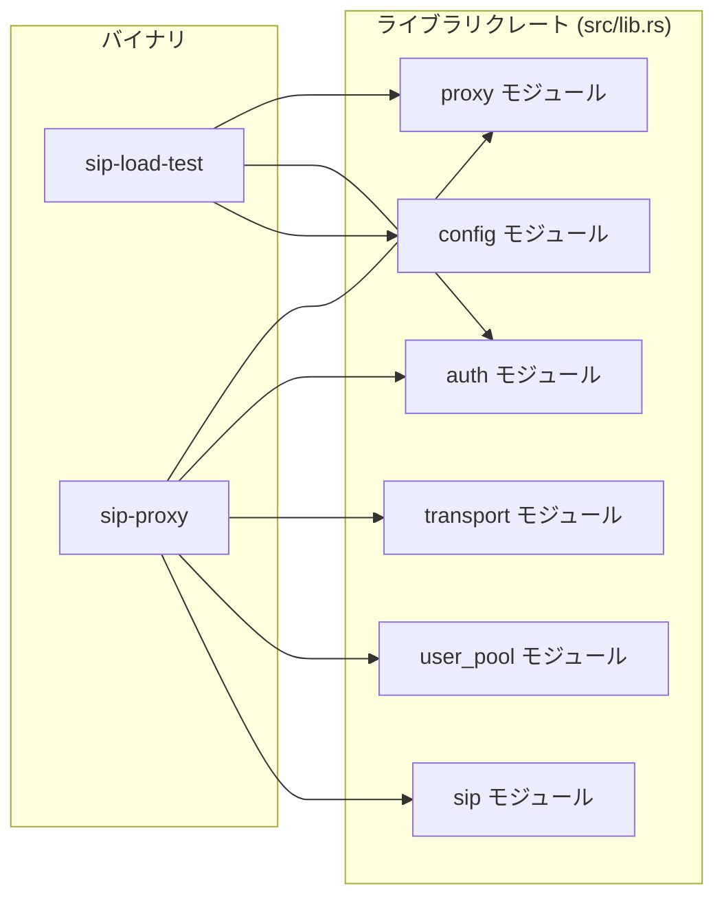

# プロキシプロセス分離

## はじめに

本ドキュメントは、SIP負荷試験ツールのプロキシプロセス分離に関する要件と設計を定義する。現在、UAC・UAS・SIPプロキシは同一プロセス内で動作しているが、プロキシは試験ツールを検証するためのコンポーネントであり、負荷試験ツール本体（UAC+UAS）とは独立して動作すべきである。本変更により、プロキシを別プロセス（別バイナリ）として分離し、負荷試験ツールとプロキシを独立して起動・停止できるようにする。

### 概要

本設計は、SIP負荷試験ツールのSIPプロキシを独立したバイナリ/プロセスとして分離するための技術設計を定義する。

現在の構成では、UAC・UAS・SIPプロキシが同一プロセス内で動作しており、`Orchestrator`がプロキシのライフサイクルを管理している。本変更により以下を実現する:

1. プロキシ専用バイナリ（`sip-proxy`）を新設し、独立プロセスとして起動可能にする
2. 負荷試験ツール（`sip-load-test`）からプロキシのインプロセス起動を除去する
3. 既存の`src/proxy/`モジュールのロジックをライブラリクレートとして両バイナリから共有する

### 設計判断

- **バイナリ名**: `sip-proxy`（Cargo.tomlに`[[bin]]`セクションとして追加）
- **設定形式**: JSON（既存の負荷試験ツールと同じ形式を採用し、学習コストを最小化）
- **シグナルハンドリング**: 既存の`ctrlc`クレートを再利用（SIGINT/SIGTERM対応）
- **プロキシ設定構造体**: 新規`ProxyServerConfig`を定義（既存`ProxyConfig`はプロキシ内部の転送設定として維持）

## 用語集

- **負荷試験ツール**: UAC+UASを含む負荷試験の本体プロセス。既存の`sip-load-test`バイナリに相当する
- **プロキシバイナリ**: SIPプロキシを単独で実行するための新規バイナリ
- **UAC**: User Agent Client。SIPリクエストを生成・送信する発信側エージェント
- **UAS**: User Agent Server。SIPリクエストを受信・応答する着信側エージェント
- **SIPプロキシ**: SIPリクエストをステートレスに転送するStateless Proxy
- **Orchestrator**: UAC・UASの起動・停止・試験実行を統括するコンポーネント
- **BuiltinProxyConfig**: 設定ファイル内のプロキシ設定セクション
- **ヘルスチェック**: OPTIONSリクエストを送信してプロキシの稼働を確認する機能
- **CLI**: コマンドラインインターフェース。clapクレートによるサブコマンド定義

## アーキテクチャ

### 変更前



### 変更後



### コンポーネント間の依存関係



## 要件

### 要件1: プロキシ用バイナリの新設

**ユーザストーリー:** 開発者として、SIPプロキシを独立したバイナリとして起動したい。負荷試験ツール本体とは別プロセスで動作させることで、プロキシの起動・停止を独立して制御できるようにするため。

#### 受け入れ基準

1. THE プロキシバイナリ SHALL Cargo.tomlに`[[bin]]`セクションとして定義される
2. THE プロキシバイナリ SHALL 設定ファイルのパスをコマンドライン引数として受け取る
3. WHEN 設定ファイルが指定された場合、THE プロキシバイナリ SHALL 設定ファイルからプロキシの設定（ホスト、ポート、認証設定）を読み込む
4. WHEN プロキシバイナリが起動された場合、THE プロキシバイナリ SHALL 指定されたホスト・ポートでSIPメッセージの受信を開始する
5. WHEN SIGINT/SIGTERMシグナルを受信した場合、THE プロキシバイナリ SHALL グレースフルにシャットダウンする

### 要件2: プロキシ設定の分離

**ユーザストーリー:** 開発者として、プロキシ専用の設定ファイルまたは設定構造を使用したい。プロキシの設定を負荷試験ツールの設定から独立させることで、それぞれを個別に管理できるようにするため。

#### 受け入れ基準

1. THE プロキシバイナリ SHALL プロキシの動作に必要な設定（ホスト、ポート、転送先アドレス、認証設定）をJSON設定ファイルから読み込む
2. THE プロキシバイナリ SHALL 設定ファイルのバリデーションを実行し、不正な値に対してエラーメッセージを返す
3. THE 設定パーサ SHALL JSON設定ファイルをプロキシ設定構造体にパースする
4. THE 設定フォーマッタ SHALL プロキシ設定構造体をJSON設定ファイルにフォーマットする
5. FOR ALL 有効なプロキシ設定構造体に対して、パースしてフォーマットしてパースした結果は元の構造体と等価である（ラウンドトリップ特性）
6. WHEN ユーザファイルパスが設定に含まれる場合、THE プロキシバイナリ SHALL ユーザファイルを読み込み認証用のユーザプールを構築する

### 要件3: Orchestratorからのプロキシ起動の除去

**ユーザストーリー:** 開発者として、Orchestratorがプロキシをインプロセスで起動する機能を除去したい。プロキシは別プロセスとして事前に起動されていることを前提とし、Orchestratorの責務をUAC+UASの管理に限定するため。

#### 受け入れ基準

1. THE Orchestrator SHALL プロキシのインプロセス起動を行わない
2. THE Orchestrator SHALL UAC・UASの起動・停止・試験実行の管理のみを行う
3. WHEN 負荷試験を実行する場合、THE Orchestrator SHALL プロキシが外部プロセスとして稼働していることを前提とする
4. THE Orchestrator SHALL `set_proxy`メソッドおよびプロキシ関連のフィールドを保持しない
5. THE Orchestrator SHALL ヘルスチェック機能を維持し、外部プロキシの稼働確認を行う

### 要件4: 負荷試験ツールの設定変更

**ユーザストーリー:** 開発者として、負荷試験ツールの設定から`builtin_proxy`セクションを除去したい。プロキシは別プロセスで動作するため、負荷試験ツール側でプロキシの設定を管理する必要がなくなるため。

#### 受け入れ基準

1. THE Config構造体 SHALL `builtin_proxy`フィールドを保持しない
2. THE Config構造体 SHALL `proxy_host`と`proxy_port`フィールドを維持し、外部プロキシの接続先として使用する
3. WHEN 設定ファイルに`builtin_proxy`セクションが含まれる場合、THE 設定パーサ SHALL そのセクションを無視してエラーを発生させない（後方互換性）
4. THE 設定バリデーション SHALL `builtin_proxy`に関するバリデーションルールを含まない

### 要件5: プロキシバイナリのシグナルハンドリング

**ユーザストーリー:** 開発者として、プロキシバイナリがシグナルを受信した際にグレースフルにシャットダウンしたい。処理中のSIPメッセージを適切に完了させてからプロセスを終了するため。

#### 受け入れ基準

1. WHEN SIGINT/SIGTERMシグナルを受信した場合、THE プロキシバイナリ SHALL シャットダウンフラグを設定する
2. WHILE シャットダウンフラグが設定されている場合、THE プロキシバイナリ SHALL 新規SIPメッセージの受信を停止する
3. THE プロキシバイナリ SHALL シャットダウン時にUDPソケットを適切にクローズする

### 要件6: 既存プロキシロジックの再利用

**ユーザストーリー:** 開発者として、既存の`src/proxy/`モジュールのSIPプロキシロジックをプロキシバイナリでそのまま再利用したい。プロキシの転送ロジック・認証ロジック・ロケーションサービスの実装を重複させないため。

#### 受け入れ基準

1. THE プロキシバイナリ SHALL `src/proxy/`モジュールの`SipProxy`構造体を使用してSIPメッセージを処理する
2. THE プロキシバイナリ SHALL `src/proxy/`モジュールの`LocationService`を使用してREGISTER処理を行う
3. THE プロキシバイナリ SHALL `src/auth/`モジュールの認証ロジックを使用してDigest認証を処理する
4. THE `src/proxy/`モジュール SHALL ライブラリクレートとして負荷試験ツールバイナリとプロキシバイナリの両方から参照可能である

## 設計

### コンポーネントとインターフェース

#### 1. 新規ファイル: `src/bin/sip_proxy.rs`

プロキシバイナリのエントリポイント。以下の責務を持つ:

- コマンドライン引数の解析（設定ファイルパス）
- `ProxyServerConfig`の読み込みとバリデーション
- UDPトランスポートの初期化
- `SipProxy`インスタンスの生成
- SIPメッセージ受信ループの実行
- SIGINT/SIGTERMによるグレースフルシャットダウン

```rust
// src/bin/sip_proxy.rs
use clap::Parser;

#[derive(Parser)]
#[command(name = "sip-proxy")]
struct Args {
    /// JSON設定ファイルパス
    config: PathBuf,
}
```

#### 2. 新規: `ProxyServerConfig`（`src/config/mod.rs`に追加）

プロキシバイナリ専用の設定構造体。既存の`BuiltinProxyConfig`とは異なり、プロキシ単独動作に必要な全設定を含む。

```rust
#[derive(Debug, Clone, PartialEq, Serialize, Deserialize)]
pub struct ProxyServerConfig {
    pub host: String,
    pub port: u16,
    pub forward_host: String,
    pub forward_port: u16,
    pub auth_enabled: bool,
    pub auth_realm: String,
    pub users_file: Option<String>,
}
```

関連関数:
- `load_proxy_config_from_file(path: &Path) -> Result<ProxyServerConfig, SipLoadTestError>`: ファイルからJSON読み込み+バリデーション
- `load_proxy_config_from_str(json: &str) -> Result<ProxyServerConfig, SipLoadTestError>`: 文字列からJSON読み込み+バリデーション
- `ProxyServerConfig::validate(&self) -> Result<(), Vec<String>>`: バリデーション

#### 3. 変更: `Orchestrator`（`src/orchestrator/mod.rs`）

以下のフィールド・メソッドを除去:
- `proxy: Option<Arc<SipProxy>>` フィールド
- `set_proxy()` メソッド
- `graceful_shutdown()`内のプロキシシャットダウン処理

ヘルスチェック機能は維持（外部プロキシの稼働確認用）。

#### 4. 変更: `Config`（`src/config/mod.rs`）

- `builtin_proxy: Option<BuiltinProxyConfig>` フィールドを除去
- `proxy_host`と`proxy_port`は維持（外部プロキシの接続先）
- デシリアライズ時に`builtin_proxy`キーが存在しても無視する（後方互換性）
- `BuiltinProxyConfig`構造体自体は除去

#### 5. 既存維持: `SipProxy`（`src/proxy/mod.rs`）

変更なし。ライブラリクレートの一部として両バイナリから参照される。

### データモデル

#### ProxyServerConfig

プロキシバイナリの設定を表す構造体。JSON設定ファイルからデシリアライズされる。

| フィールド | 型 | 必須 | デフォルト | 説明 |
|---|---|---|---|---|
| `host` | `String` | Yes | `"127.0.0.1"` | プロキシがリッスンするホスト |
| `port` | `u16` | Yes | `5060` | プロキシがリッスンするポート |
| `forward_host` | `String` | Yes | `"127.0.0.1"` | 転送先ホスト（UASアドレス） |
| `forward_port` | `u16` | Yes | `5080` | 転送先ポート |
| `auth_enabled` | `bool` | No | `false` | Digest認証の有効/無効 |
| `auth_realm` | `String` | No | `"sip-proxy"` | 認証レルム |
| `users_file` | `Option<String>` | No | `None` | ユーザファイルパス（認証用） |

#### JSON設定ファイル例

```json
{
  "host": "127.0.0.1",
  "port": 5060,
  "forward_host": "127.0.0.1",
  "forward_port": 5080,
  "auth_enabled": true,
  "auth_realm": "sip-proxy",
  "users_file": "users.json"
}
```

#### バリデーションルール

- `port` > 0
- `forward_port` > 0
- `auth_enabled`が`true`の場合、`users_file`が指定されていること
- `auth_realm`が空文字でないこと（`auth_enabled`が`true`の場合）

#### Config構造体の変更

変更前:
```rust
pub struct Config {
    // ... 既存フィールド ...
    pub builtin_proxy: Option<BuiltinProxyConfig>,
}
```

変更後:
```rust
pub struct Config {
    // ... 既存フィールド ...
    // builtin_proxy フィールドを除去
    // デシリアライズ時は #[serde(default)] により未知フィールドを無視
}
```

後方互換性のため、`#[serde(deny_unknown_fields)]`は使用せず、`builtin_proxy`キーが設定ファイルに存在してもエラーにしない。現在の`Config`は`#[serde(default)]`を使用しており、未知フィールドはデフォルトで無視されるため、特別な対応は不要。

#### Cargo.toml変更

```toml
[[bin]]
name = "sip-proxy"
path = "src/bin/sip_proxy.rs"
```

## 正当性プロパティ (Correctness Properties)

*プロパティとは、システムのすべての有効な実行において成立すべき特性や振る舞いのことである。プロパティは、人間が読める仕様と機械的に検証可能な正当性保証の橋渡しとなる。*

### Property 1: ProxyServerConfig のラウンドトリップ

*任意の*有効な`ProxyServerConfig`に対して、JSONにシリアライズしてからデシリアライズした結果は、元の構造体と等価である。

**Validates: Requirements 2.3, 2.4, 2.5**

### Property 2: 不正な設定値のバリデーション拒否

*任意の*`port`が0または`forward_port`が0である`ProxyServerConfig`に対して、`validate()`はエラーを返す。また、`auth_enabled`が`true`かつ`users_file`が`None`である場合もエラーを返す。

**Validates: Requirements 2.2**

### Property 3: 後方互換性 - builtin_proxy の無視

*任意の*有効な`Config` JSONに`builtin_proxy`フィールドを追加しても、`load_from_str()`はエラーを返さず、`builtin_proxy`以外のフィールドは正しくパースされる。

**Validates: Requirements 4.3**

## エラーハンドリング

### プロキシバイナリのエラー

| エラー状況 | 処理 |
|---|---|
| 設定ファイルが存在しない | エラーメッセージを表示して終了コード1で終了 |
| 設定ファイルのJSONが不正 | パースエラーメッセージを表示して終了コード1で終了 |
| 設定値のバリデーション失敗 | バリデーションエラー一覧を表示して終了コード1で終了 |
| UDPソケットのバインド失敗 | アドレス情報付きエラーメッセージを表示して終了コード1で終了 |
| ユーザファイルの読み込み失敗 | エラーメッセージを表示して終了コード1で終了 |
| SIPメッセージのパース失敗 | ログ出力して処理を継続（既存の`SipProxy`の動作） |

### 負荷試験ツール側のエラー

| エラー状況 | 処理 |
|---|---|
| `builtin_proxy`キーが設定に存在 | 無視して正常にパース（後方互換性） |
| 外部プロキシへのヘルスチェック失敗 | 既存の`HealthCheckFailed`エラーを返す（変更なし） |

### 既存エラー型の利用

新規エラー型は追加しない。既存の`SipLoadTestError`の以下のバリアントを使用する:
- `ConfigError`: 設定ファイルの読み込み・パース・バリデーションエラー
- `NetworkError`: UDPソケットのバインド・送受信エラー
- `UserPoolError`: ユーザファイルの読み込みエラー

## テスト戦略

### テストファーストアプローチ

本プロジェクトのTDD方針に従い、すべての実装はテストを先に書いてから行う。

### ユニットテスト

以下の具体的なケースをユニットテストで検証する:

1. **ProxyServerConfig のパース**: 有効なJSON文字列からの読み込み
2. **ProxyServerConfig のバリデーション**: 各バリデーションルールの個別検証
3. **ProxyServerConfig のデフォルト値**: デフォルト値の正確性
4. **Config からの builtin_proxy 除去**: フィールドが存在しないことの確認
5. **後方互換性**: `builtin_proxy`キーを含むJSONの正常パース
6. **Orchestrator の変更**: `proxy`フィールドと`set_proxy`メソッドの除去確認
7. **CLI引数パース**: プロキシバイナリの引数パーステスト
8. **ヘルスチェック維持**: 既存のヘルスチェックテストが引き続きパスすること

### プロパティベーステスト

プロパティベーステストには`proptest`クレート（既にdev-dependenciesに含まれている）を使用する。各テストは最低100イテレーション実行する。

1. **Feature: proxy-process-separation, Property 1: ProxyServerConfig のラウンドトリップ**
   - 任意の有効な`ProxyServerConfig`を生成し、JSON serialize → deserialize のラウンドトリップを検証
   - `proptest`のカスタムStrategyで有効な設定値を生成

2. **Feature: proxy-process-separation, Property 2: 不正な設定値のバリデーション拒否**
   - 不正な設定値（port=0, forward_port=0, auth_enabled=true & users_file=None）を生成し、バリデーションがエラーを返すことを検証

3. **Feature: proxy-process-separation, Property 3: 後方互換性 - builtin_proxy の無視**
   - 任意の有効な`Config`をJSON化し、`builtin_proxy`フィールドを追加してもパースが成功することを検証

### テストの配置

- `src/config/mod.rs` 内の `#[cfg(test)]` モジュール: ProxyServerConfig関連のユニットテスト・プロパティテスト
- `src/orchestrator/mod.rs` 内の `#[cfg(test)]` モジュール: Orchestrator変更のテスト
- `tests/project_structure_test.rs`: Cargo.tomlのバイナリ定義確認（既存パターンに従う）
