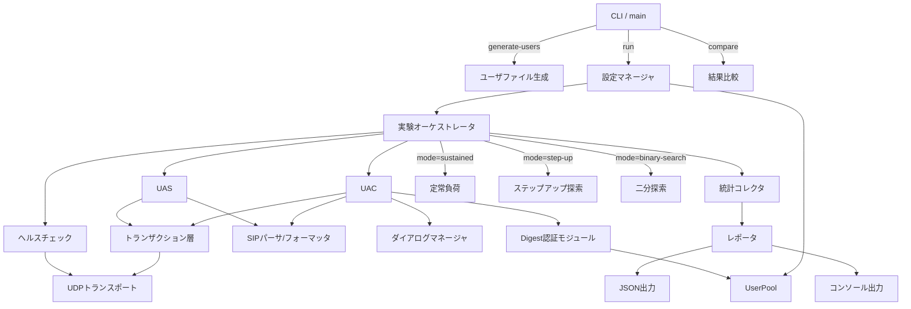
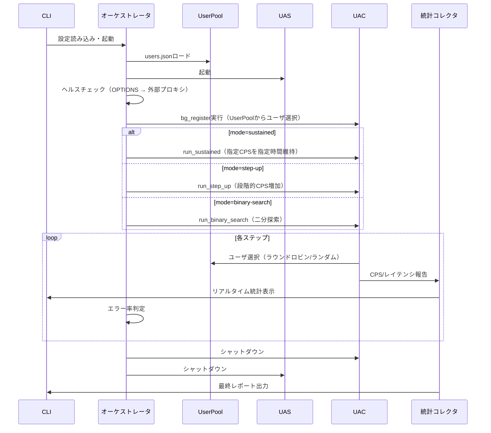

# SIP負荷試験ツール

## はじめに

本ドキュメントは、Rustで実装するSIP負荷試験ツールの要件と設計を定義する。本ツールは、Go言語で実装された先行プロジェクト（zurustar/sotafugy10のsipexperiment）と同等の機能をRustで再実装し、GCオーバーヘッドの排除による高性能化を目的とする。

本ツールはSIP負荷試験ツールのみを対象とする。UAC/UASはインプロセスで実行する。テスト用のStateless SIPプロキシは独立バイナリ（`sip-proxy`）として提供し、別プロセスで起動する（詳細は [プロキシプロセス分離](proxy-process-separation.md) を参照）。外部SIPサーバをテスト対象とする構成にも対応する。SIP Digest認証（RFC 2617/3261）にも対応し、認証を要求するSIPサーバに対する負荷試験を実行可能とする。

### 概要

本ツールはRustで実装するSIP負荷試験ツールである。UAC、UASをインプロセスで実行し、UDP/IPv4上でSIPメッセージを送受信する。Tokioベースの非同期ランタイムを使用し、GCなしの高性能な負荷生成を実現する。SIPトランザクション層（RFC 3261 Section 17準拠）により、UDPパケットロス時の再送機能を提供する（詳細は [SIPトランザクション層](sip-transaction-layer.md) を参照）。

主要な機能：
- SIPメッセージのパース・フォーマット（RFC 3261準拠）
- UAC: REGISTER / INVITE-BYE シナリオ実行、Session-Timer対応、Digest認証対応
- UAS: インプロセスSIP応答サーバ
- テスト用Stateless SIPプロキシ: 独立バイナリ、Location Service、Digest認証チャレンジ、デバッグログ、複数ソケット対応、rport対応
- UserPool: `users.json`ファイルによるユーザ情報の一元管理。UACとプロキシが同一のUserPoolを共有し認証情報のズレを防止
- CLIサブコマンド: `generate-users`（ユーザファイル生成）、`run`（負荷試験実行）、`compare`（結果比較）
- 実行モード: `sustained`（定常負荷）、`step-up`（ステップアップ探索）、`binary-search`（二分探索）
- 統計収集、JSON結果出力、結果比較
- max_dialogs自動計算: `effective_cps × call_duration × margin_factor` による最適値の自動算出

### 関連ドキュメント

| ドキュメント | 概要 |
|---|---|
| [プロキシプロセス分離](proxy-process-separation.md) | プロキシの独立バイナリ化の詳細設計 |
| [プロキシデバッグログ](proxy-debug-logging.md) | プロキシのデバッグログ機能の詳細設計 |
| [プロキシ複数ソケット・rport対応](proxy-multi-socket-rport.md) | 複数UDPソケット対応とRFC 3581 rport対応の詳細設計 |
| [パフォーマンス最適化](performance-optimization.md) | パフォーマンスボトルネックの最適化経緯とベンチマーク結果 |
| [SIPトランザクション層](sip-transaction-layer.md) | RFC 3261準拠のトランザクション層の詳細設計 |


## 用語集

- **UAC**: User Agent Client。SIPリクエストを生成・送信する発信側エージェント
- **UAS**: User Agent Server。SIPリクエストを受信・応答する着信側エージェント
- **Dialog**: SIPにおける通話セッション。INVITEで開始しBYEで終了する
- **CPS**: Calls Per Second。1秒あたりの呼処理数
- **SIP**: Session Initiation Protocol（RFC 3261）。通話セッションの確立・変更・終了を行うプロトコル
- **REGISTER**: SIPメソッド。ユーザの位置情報をサーバに登録する
- **INVITE**: SIPメソッド。通話セッションの開始を要求する
- **BYE**: SIPメソッド。通話セッションの終了を要求する
- **ACK**: SIPメソッド。INVITEに対する最終レスポンスの確認応答
- **OPTIONS**: SIPメソッド。サーバの機能確認やヘルスチェックに使用する
- **Session-Timer**: RFC 4028で定義されるセッション維持機構。Session-Expiresヘッダで指定された間隔でre-INVITEを送信し、セッションの生存を確認する
- **Session-Expires**: SIPヘッダ。セッションの有効期限を秒数で指定する
- **Min-SE**: SIPヘッダ。Session-Expiresの最小許容値を秒数で指定する
- **Call-ID**: SIPヘッダ。ダイアログを一意に識別する識別子
- **CSeq**: SIPヘッダ。トランザクション内のリクエスト順序を示す番号
- **Via**: SIPヘッダ。リクエストの経路情報を記録する
- **SIPパーサ**: SIPメッセージのバイト列を構造化データに変換するコンポーネント
- **SIPフォーマッタ**: 構造化データをSIPメッセージのバイト列に変換するコンポーネント
- **実験オーケストレータ**: UAS/UACのインプロセス実行、ヘルスチェック、ステップアップ/二分探索の制御、結果収集を統括するコンポーネント
- **ステップアップモード**: CPSを段階的に増加させてシステムの限界を自動探索する動作モード
- **二分探索モード**: 二分探索アルゴリズムで限界CPSを効率的に特定する動作モード
- **負荷パターン**: 各ステップ内での呼量の時間的変化パターン（ランプアップ、持続、バースト）
- **統計コレクタ**: CPS、レイテンシ、ステータスコード分布などの統計情報を収集・集計するコンポーネント
- **UDPトランスポート**: UDP/IPv4上でSIPメッセージを送受信するトランスポート層コンポーネント
- **Stateless Proxy**: SIPリクエストをトランザクション状態を保持せずに転送するSIPプロキシ。リクエストのViaヘッダを操作し、Record-Routeヘッダを挿入してルーティングを行う
- **Digest認証**: RFC 2617/3261で定義されるHTTP Digest認証方式。チャレンジ・レスポンス方式でSIPリクエストの送信者を認証する
- **401 Unauthorized**: SIPレスポンス。レジストラやUASが認証を要求する際に送信する
- **407 Proxy Authentication Required**: SIPレスポンス。プロキシが認証を要求する際に送信する
- **WWW-Authenticate**: SIPヘッダ。401レスポンスに含まれ、認証チャレンジのパラメータを提供する
- **Proxy-Authenticate**: SIPヘッダ。407レスポンスに含まれ、プロキシ認証チャレンジのパラメータを提供する
- **Authorization**: SIPヘッダ。401チャレンジに対する認証レスポンスを含む
- **Proxy-Authorization**: SIPヘッダ。407チャレンジに対するプロキシ認証レスポンスを含む
- **nonce**: Digest認証で使用される一回限りの値。サーバが生成しクライアントに提供する
- **realm**: Digest認証の保護領域を示す文字列。認証のスコープを定義する
- **rport**: RFC 3581で定義されたViaヘッダパラメータ。レスポンスの送信先ポートとして送信元の実際のポートを使用することを要求する

## アーキテクチャ



> **注**: テスト用SIPプロキシは独立バイナリ（`sip-proxy`）として別プロセスで動作する。詳細は [プロキシプロセス分離](proxy-process-separation.md) を参照。

### 全体フロー



### CLIサブコマンド構成

```
sip-load-test
├── generate-users   ユーザファイル生成
│   --prefix <PREFIX>           ユーザ名プレフィックス（デフォルト: "user"）
│   --start <N>                 開始番号（デフォルト: 1）
│   --count <N>                 生成ユーザ数
│   --domain <DOMAIN>           SIPドメイン
│   --password-pattern <PAT>    パスワードパターン（例: "pass{index}"）
│   -o <FILE>                   出力ファイルパス
│   --append                    既存ファイルへの追記
│
├── run              負荷試験実行
│   <CONFIG>                    JSON設定ファイルパス
│   --mode <MODE>               実行モード: sustained|step-up|binary-search
│   --output <FILE>             JSON結果出力先
│
└── compare          結果比較
    <CURRENT>                   現在の結果JSONファイル
    <PREVIOUS>                  過去の結果JSONファイル
```

### Digest認証フロー


## 要件

### 要件1: SIPメッセージのパース・フォーマット

**ユーザストーリー:** 開発者として、SIPメッセージを正確にパース・フォーマットしたい。これにより、負荷試験ツールが正しいSIPメッセージを送受信できるようになる。

#### 受入基準

1. WHEN 有効なSIPリクエストのバイト列を受信した場合、THE SIPパーサ SHALL メソッド、Request-URI、SIPバージョン、ヘッダ、ボディを含む構造化データに変換する
2. WHEN 有効なSIPレスポンスのバイト列を受信した場合、THE SIPパーサ SHALL SIPバージョン、ステータスコード、理由句、ヘッダ、ボディを含む構造化データに変換する
3. WHEN 不正なSIPメッセージを受信した場合、THE SIPパーサ SHALL パースエラーの詳細を含むエラーを返す
4. THE SIPフォーマッタ SHALL 構造化データからRFC 3261準拠のSIPメッセージバイト列を生成する
5. FOR ALL 有効なSIPメッセージ構造体について、フォーマットしてからパースした結果は元の構造体と等価である（ラウンドトリップ特性）

### 要件2: UACシナリオ実行

**ユーザストーリー:** 負荷試験担当者として、REGISTERおよびINVITE-BYEフローを自動実行したい。これにより、SIPサーバの基本的な呼処理性能を計測できる。

#### 受入基準

1. WHEN REGISTERシナリオが指定された場合、THE UAC SHALL REGISTERリクエストを送信し、200 OKレスポンスを受信して登録完了とする
2. WHEN INVITE-BYEシナリオが指定された場合、THE UAC SHALL INVITEリクエストを送信し、200 OKを受信後ACKを送信し、指定された通話保持時間の経過後にBYEを送信してダイアログを終了する
3. WHEN SIPレスポンスを受信した場合、THE UAC SHALL Call-IDに基づいて対応するダイアログにレスポンスをディスパッチする
4. WHEN ダイアログのタイムアウトが発生した場合、THE UAC SHALL 該当ダイアログをタイムアウトとして統計に記録し、リソースを解放する

### 要件3: Session-Timer処理

**ユーザストーリー:** 負荷試験担当者として、長時間通話のセッション維持を正しく処理したい。これにより、Session-Timerを使用するSIPサーバに対しても正確な負荷試験を実行できる。

#### 受入基準

1. WHEN INVITEの200 OKレスポンスにSession-Expiresヘッダが含まれる場合、THE UAC SHALL セッション有効期限を記録し、有効期限の半分の時間が経過した時点でre-INVITEを送信してセッションを更新する
2. WHEN UASがSession-Expiresヘッダ付きのINVITEを受信した場合、THE UAS SHALL 200 OKレスポンスにSession-Expiresヘッダを含めて応答する
3. WHEN re-INVITEを受信した場合、THE UAS SHALL 200 OKレスポンスを送信してセッションを更新する
4. WHEN セッション有効期限内にre-INVITEもBYEも受信しない場合、THE UAS SHALL セッションをタイムアウトとして終了し、統計に記録する

### 要件4: UASインプロセス実行

**ユーザストーリー:** 負荷試験担当者として、UASをインプロセスで実行したい。これにより、外部SIPサーバへの着信側エンドポイントとして動作させることができる。

#### 受入基準

1. WHEN INVITEリクエストを受信した場合、THE UAS SHALL 100 Trying暫定レスポンスを送信し、続いて200 OK最終レスポンスを送信する
2. WHEN ACKリクエストを受信した場合、THE UAS SHALL ダイアログの状態を確認済みに更新する
3. WHEN BYEリクエストを受信した場合、THE UAS SHALL 200 OKレスポンスを送信し、ダイアログを終了する
4. WHEN 存在しないダイアログに対するBYEを受信した場合、THE UAS SHALL 481 Call/Transaction Does Not Existレスポンスを送信する
5. WHEN REGISTERリクエストを受信した場合、THE UAS SHALL 200 OKレスポンスを送信する

### 要件5: 高並行ダイアログ管理

**ユーザストーリー:** 負荷試験担当者として、大量の同時ダイアログを管理したい。これにより、大規模な負荷試験を実行できる。

#### 受入基準

1. THE UAC SHALL 設定で指定されたmax_dialogs数の同時ダイアログを管理する能力を持つ。max_dialogsが省略された場合は `effective_cps × call_duration × margin_factor` で自動計算される
2. WHILE 複数のダイアログが同時に進行中の場合、THE UAC SHALL 各ダイアログの状態を独立して管理する
3. WHEN 新しいダイアログを開始する場合、THE UAC SHALL 一意なCall-ID、From-tag、CSeqを生成する
4. WHEN 同時ダイアログ数がmax_dialogsに達した場合、THE UAC SHALL 既存ダイアログの終了を待ってから新規ダイアログを開始する

### 要件6: 負荷パターン制御

**ユーザストーリー:** 負荷試験担当者として、ランプアップ・持続・バーストの負荷パターンを制御したい。これにより、様々な負荷条件下でのサーバ性能を評価できる。

#### 受入基準

1. WHEN ランプアップパターンが指定された場合、THE UAC SHALL 0 CPSから目標CPSまで、指定された持続時間をかけて線形に呼量を増加させる
2. WHEN 持続パターンが指定された場合、THE UAC SHALL 指定されたCPSを指定された期間維持する
3. WHEN バーストパターンが指定された場合、THE UAC SHALL 指定されたCPSの負荷を即座に発生させる
4. WHILE 負荷パターンを実行中の場合、THE UAC SHALL 実際のCPSが目標CPSに対して±5%以内の精度を維持する

### 要件7: ステップアップモード

**ユーザストーリー:** 負荷試験担当者として、CPSを段階的に増加させてシステムの限界を自動探索したい。これにより、手動で閾値を探す手間を省ける。

#### 受入基準

1. WHEN ステップアップモードが設定された場合、THE 実験オーケストレータ SHALL initial_cpsから開始し、step_sizeずつCPSを増加させながら各ステップをstep_duration間実行する
2. WHEN あるステップのエラー率がerror_thresholdを超えた場合、THE 実験オーケストレータ SHALL そのステップで探索を停止する
3. WHEN ステップアップ探索が完了した場合、THE 実験オーケストレータ SHALL エラー率が閾値以下であった最後のステップのCPSを安定動作可能な最大CPSとして報告する
4. WHEN CPSがmax_cpsに達した場合、THE 実験オーケストレータ SHALL そのステップを実行後に探索を終了する

### 要件8: 二分探索モード

**ユーザストーリー:** 負荷試験担当者として、二分探索で限界CPSを効率的に特定したい。これにより、ステップアップよりも少ない試行回数で限界値を見つけられる。

#### 受入基準

1. WHEN 二分探索モードが設定された場合、THE 実験オーケストレータ SHALL initial_cpsから開始し、二分探索アルゴリズムで限界CPSを探索する
2. WHEN あるCPSでエラー率がerror_threshold以下の場合、THE 実験オーケストレータ SHALL 探索範囲の上半分を次の探索対象とする
3. WHEN あるCPSでエラー率がerror_thresholdを超えた場合、THE 実験オーケストレータ SHALL 探索範囲の下半分を次の探索対象とする
4. WHEN 探索範囲がconvergence_threshold以下に収束した場合、THE 実験オーケストレータ SHALL 探索を終了し、収束したCPSを限界CPSとして報告する
5. WHEN 各ステップの間にcooldown_durationが設定されている場合、THE 実験オーケストレータ SHALL ステップ間にクールダウン期間を設ける

### 要件9: 実験オーケストレーション

**ユーザストーリー:** 負荷試験担当者として、UAS起動からUAC負荷実行、シャットダウンまでを自動化したい。これにより、一連の負荷試験を一つのコマンドで実行できる。

#### 受入基準

1. WHEN 実験モードで起動された場合、THE 実験オーケストレータ SHALL テスト対象SIPサーバへのOPTIONSリクエストによるヘルスチェックで疎通を確認する
2. WHEN ヘルスチェックがhealth_check_retries回失敗した場合、THE 実験オーケストレータ SHALL エラーを報告して実験を中止する
3. WHEN ヘルスチェックが成功した場合、THE 実験オーケストレータ SHALL UASをインプロセスで起動し、UASのヘルスチェック完了後にUACを起動して負荷テストを実行する
4. WHEN 負荷テストが完了した場合、THE 実験オーケストレータ SHALL UAC → UASの順にグレースフルシャットダウンを実行する
5. WHEN SIGINT/SIGTERMシグナルを受信した場合、THE 実験オーケストレータ SHALL 進行中のダイアログにBYEを送信し、全コンポーネントをグレースフルシャットダウンする

### 要件10: バックグラウンドREGISTER

**ユーザストーリー:** 負荷試験担当者として、テスト前にバックグラウンドでREGISTERを実行したい。これにより、SIPサーバのLocation Serviceにユーザ情報を事前登録した状態でINVITE-BYEテストを実行できる。

#### 受入基準

1. WHEN bg_register_countが0より大きい場合、THE 実験オーケストレータ SHALL 負荷テスト開始前に指定数のREGISTERリクエストを送信してユーザを登録する
2. WHEN バックグラウンドREGISTERが完了した場合、THE 実験オーケストレータ SHALL 登録成功数と失敗数を報告する

### 要件11: 統計収集とレポート

**ユーザストーリー:** 負荷試験担当者として、試験結果をリアルタイムで確認し、最終レポートを取得したい。これにより、サーバの性能特性を把握できる。

#### 受入基準

1. WHILE 負荷試験が実行中の場合、THE 統計コレクタ SHALL 1秒間隔で現在のCPS、累計呼数、成功数、失敗数、アクティブダイアログ数を収集する
2. WHILE 負荷試験が実行中の場合、THE 統計コレクタ SHALL レイテンシのp50、p90、p95、p99パーセンタイルを計算する
3. WHILE 負荷試験が実行中の場合、THE 統計コレクタ SHALL SIPステータスコード別のレスポンス数を集計する
4. WHEN 統計情報が更新された場合、THE 統計コレクタ SHALL 標準出力にフォーマットされた統計サマリを表示する
5. WHEN 負荷試験が完了した場合、THE 統計コレクタ SHALL 最終結果サマリをコンソールに出力する

### 要件12: JSON結果出力

**ユーザストーリー:** 負荷試験担当者として、試験結果をJSON形式で保存したい。これにより、結果の自動処理や過去結果との比較が可能になる。

#### 受入基準

1. WHEN `-output`フラグでファイルパスが指定された場合、THE ツール SHALL 試験結果をJSON形式で指定ファイルに出力する
2. THE JSON結果 SHALL 以下の情報を含む：試験設定、総呼数、成功数、失敗数、CPS統計、レイテンシパーセンタイル、ステータスコード分布、試験開始・終了時刻
3. FOR ALL 有効な結果構造体について、JSONにシリアライズしてからデシリアライズした結果は元の構造体と等価である（ラウンドトリップ特性）

### 要件13: 結果比較

**ユーザストーリー:** 負荷試験担当者として、過去の試験結果と現在の結果を比較したい。これにより、SIPサーバの性能変化を定量的に把握できる。

#### 受入基準

1. WHEN `-compare`フラグで過去の結果JSONファイルが指定された場合、THE ツール SHALL 過去の結果と現在の結果を比較する
2. WHEN 結果比較を実行した場合、THE ツール SHALL CPS変化率、レイテンシ変化率（各パーセンタイル）、エラー率変化を表示する
3. WHEN 結果比較を実行した場合、THE ツール SHALL 各指標について改善・悪化・変化なしを明示する

### 要件14: 設定管理

**ユーザストーリー:** 負荷試験担当者として、JSON設定ファイルで試験パラメータを指定したい。これにより、柔軟に試験条件を変更できる。

#### 受入基準

1. WHEN JSON設定ファイルパスが位置引数として指定された場合、THE 設定マネージャ SHALL ファイルを読み込み、設定構造体にデシリアライズする
2. WHEN 設定ファイルが指定されない場合、THE 設定マネージャ SHALL デフォルト設定値を使用する
3. WHEN 設定値が不正な場合、THE 設定マネージャ SHALL 具体的なエラーメッセージを表示して起動を中止する
4. THE 設定マネージャ SHALL 以下のパラメータを設定可能とする：proxy_host、proxy_port、uac_host、uac_port、uas_host、uas_port、target_cps、max_dialogs（Option型、省略時は自動計算）、duration、scenario、pattern、call_duration、session_expires（デフォルト300秒）、health_check_timeout、health_check_retries、shutdown_timeout、uac_port_count、uas_port_count、bg_register_count、auth_enabled、auth_realm
5. THE 設定マネージャ SHALL ステップアップモード設定（initial_cps、max_cps、step_size、step_duration、error_threshold）を設定可能とする
6. THE 設定マネージャ SHALL 二分探索モード設定（initial_cps、step_size、step_duration、error_threshold、convergence_threshold、cooldown_duration）を設定可能とする
7. THE 設定マネージャ SHALL トランザクション層設定（transaction_t1_ms、transaction_t2_ms、transaction_t4_ms、max_transactions）を設定可能とする
8. FOR ALL 有効な設定構造体について、JSONにシリアライズしてからデシリアライズした結果は元の構造体と等価である（ラウンドトリップ特性）

### 要件15: UDPトランスポート

**ユーザストーリー:** 開発者として、UDPソケットの性能を最大化したい。これにより、トランスポート層がボトルネックにならない負荷試験を実現できる。

#### 受入基準

1. THE UDPトランスポート SHALL 設定されたuac_port_count/uas_port_countに基づき複数のUDPソケットを使用して送受信の並列度を向上させる
2. WHEN UDPパケットを受信した場合、THE UDPトランスポート SHALL パケットをパースしてCall-IDに基づき対応するダイアログハンドラにディスパッチする
3. THE UDPトランスポート SHALL 不要なメモリアロケーションを最小化してパケット処理を行う

### 要件16: グレースフルシャットダウン

**ユーザストーリー:** 負荷試験担当者として、試験を安全に停止したい。これにより、アクティブなダイアログを適切に終了し、最終統計を取得できる。

#### 受入基準

1. WHEN SIGINT/SIGTERMシグナルを受信した場合、THE UAC SHALL 新規ダイアログの生成を停止する
2. WHEN シャットダウンが開始された場合、THE UAC SHALL すべてのアクティブなダイアログに対してBYEリクエストを送信する
3. WHEN すべてのダイアログが終了した場合またはshutdown_timeoutが経過した場合、THE ツール SHALL 最終統計サマリを出力してプロセスを終了する
4. IF shutdown_timeout以内にすべてのダイアログが終了しない場合、THEN THE ツール SHALL 残存ダイアログを強制終了し、最終統計を出力してプロセスを終了する

### 要件17: エラーハンドリング

**ユーザストーリー:** 負荷試験担当者として、ネットワークエラーやタイムアウトが発生しても試験を継続したい。これにより、安定した長時間の負荷試験を実行できる。

#### 受入基準

1. WHEN UDPソケットの送信エラーが発生した場合、THE UAC SHALL エラーを統計に記録し、該当ダイアログをエラー状態に遷移させる
2. WHEN SIPレスポンスのパースに失敗した場合、THE UAC SHALL エラーを統計に記録し、該当パケットを破棄して処理を継続する
3. WHILE 負荷試験が実行中の場合、THE UAC SHALL 個別のダイアログエラーが他のダイアログの処理に影響を与えないことを保証する

### 要件18: CLI引数処理

**ユーザストーリー:** 負荷試験担当者として、コマンドライン引数でツールの動作を制御したい。これにより、スクリプトからの自動実行が容易になる。

#### 受入基準

1. THE ツール SHALL 位置引数としてJSON設定ファイルパスを受け付ける
2. THE ツール SHALL `-output`フラグでJSON結果ファイルの出力先を指定可能とする
3. THE ツール SHALL `-compare`フラグで比較対象の過去JSON結果ファイルを指定可能とする
4. WHEN 不正なCLI引数が指定された場合、THE ツール SHALL 使用方法を表示して終了する

### 要件19: テスト用SIPプロキシ（Stateless Proxy）

**ユーザストーリー:** 負荷試験担当者として、外部SIPサーバを用意せずにツール単体で負荷試験を実行したい。これにより、テスト環境のセットアップを簡素化し、プロキシ自体の性能特性も計測できる。

> **注**: プロキシは独立バイナリ（`sip-proxy`）として別プロセスで動作する。詳細な設計は以下を参照:
> - [プロキシプロセス分離](proxy-process-separation.md)
> - [プロキシデバッグログ](proxy-debug-logging.md)
> - [プロキシ複数ソケット・rport対応](proxy-multi-socket-rport.md)

#### 受入基準

1. THE テスト用SIPプロキシ SHALL 独立バイナリ（`sip-proxy`）としてStateless Proxyを起動し、UACからのリクエストをUASに転送する
2. WHEN SIPリクエストを受信した場合、THE テスト用SIPプロキシ SHALL 自身のViaヘッダ（`;rport`パラメータ付き）をリクエストに追加し、転送先に送信する
3. WHEN SIPレスポンスを受信した場合、THE テスト用SIPプロキシ SHALL 自身のViaヘッダを除去し、Via の `received`/`rport` パラメータを考慮して元のリクエスト送信元にレスポンスを転送する
4. WHEN INVITEリクエストを転送する場合、THE テスト用SIPプロキシ SHALL Record-Routeヘッダを挿入し、以降のダイアログ内リクエストが自身を経由するようにする
5. WHEN ダイアログ内リクエスト（ACK、BYE、re-INVITE）を受信した場合、THE テスト用SIPプロキシ SHALL Routeヘッダに基づいてリクエストを転送する
6. WHEN REGISTERリクエストを受信した場合、THE テスト用SIPプロキシ SHALL 登録情報をインメモリのLocation Serviceに保存し、200 OKレスポンスを返す
7. WHEN INVITEリクエストのRequest-URIに対応する登録情報がLocation Serviceに存在する場合、THE テスト用SIPプロキシ SHALL 登録されたContact URIにリクエストを転送する
8. IF INVITEリクエストのRequest-URIに対応する登録情報がLocation Serviceに存在しない場合、THEN THE テスト用SIPプロキシ SHALL 404 Not Foundレスポンスを返す
9. THE テスト用SIPプロキシ SHALL トランザクション状態を保持せず、各リクエストを独立して処理する（Stateless動作）
10. THE テスト用SIPプロキシ SHALL 複数UDPソケット（`bind_count`で設定可能）を使用して送受信を分散し、各ソケットに`recv_task_count`個の受信タスクを割り当てる

### 要件20: SIP Digest認証

**ユーザストーリー:** 負荷試験担当者として、Digest認証を要求するSIPサーバに対して負荷試験を実行したい。これにより、認証処理を含む実運用に近い条件での性能計測が可能になる。

#### 受入基準

1. WHEN UACが401 Unauthorizedレスポンスを受信した場合、THE UAC SHALL WWW-Authenticateヘッダからrealm、nonce、algorithmを取得し、Authorizationヘッダを付与して元のリクエストをCSeqを増加させて再送する
2. WHEN UACが407 Proxy Authentication Requiredレスポンスを受信した場合、THE UAC SHALL Proxy-Authenticateヘッダからrealm、nonce、algorithmを取得し、Proxy-Authorizationヘッダを付与して元のリクエストをCSeqを増加させて再送する
3. THE UAC SHALL MD5アルゴリズムによるDigest認証レスポンスの計算をサポートする（HA1 = MD5(username:realm:password)、HA2 = MD5(method:digest-uri)、response = MD5(HA1:nonce:HA2)）
4. WHEN 認証付きリクエストに対して再度401/407レスポンスを受信した場合、THE UAC SHALL 認証失敗として統計に記録し、該当ダイアログをエラー状態に遷移させる（無限ループ防止）
5. THE 設定マネージャ SHALL 認証用のusernameおよびpasswordを設定可能とする
6. WHEN テスト用SIPプロキシで認証が有効な場合、THE テスト用SIPプロキシ SHALL INVITEリクエストに対して407 Proxy Authentication Requiredレスポンスを送信し、Proxy-Authenticateヘッダにrealm、nonce、algorithmを含める
7. WHEN テスト用SIPプロキシで認証が有効な場合、THE テスト用SIPプロキシ SHALL REGISTERリクエストに対して401 Unauthorizedレスポンスを送信し、WWW-Authenticateヘッダにrealm、nonce、algorithmを含める
8. WHEN 認証ヘッダ付きリクエストを受信した場合、THE テスト用SIPプロキシ SHALL 設定されたusername/passwordに基づいてDigestレスポンスを検証し、認証成功の場合のみリクエストを処理する
9. IF 認証検証に失敗した場合、THEN THE テスト用SIPプロキシ SHALL 403 Forbiddenレスポンスを返す
10. THE 設定マネージャ SHALL テスト用プロキシの認証有効/無効、realm、認証用username/passwordを設定可能とする

## 設計

### コンポーネントとインターフェース

#### 1. SIPパーサ/フォーマッタ (`sip::parser`, `sip::formatter`)

SIPメッセージのバイト列と構造化データ間の変換を担当する。ゼロコピーパースを実装し、頻出ヘッダのインデックスキャッシュにより定数時間アクセスを実現。`Method` 列挙型は `Display` トレイトを実装しており、`method.to_string()` で文字列表現を取得できる（従来の `method_to_str` 関数は削除済み）。

```rust
pub fn parse_sip_message(input: &[u8]) -> Result<SipMessage, ParseError>;
pub fn format_sip_message(msg: &SipMessage) -> Vec<u8>;
pub fn format_into(msg: &SipMessage, buf: &mut Vec<u8>);  // 事前確保バッファへの直接書き込み
```

#### 2. UDPトランスポート (`transport`)

複数UDPソケットの管理と、受信パケットのディスパッチを担当する。Tokioの`UdpSocket`を使用し、ラウンドロビンによる送信分散を実装。`SipTransport` トレイトもこのモジュールで定義する。

```rust
/// トランスポート抽象化トレイト（UAC/UAS/プロキシが共通で使用）
pub trait SipTransport: Send + Sync {
    fn send_to<'a>(
        &'a self,
        data: &'a [u8],
        addr: SocketAddr,
    ) -> Pin<Box<dyn Future<Output = Result<(), SipLoadTestError>> + Send + 'a>>;
}

pub struct UdpTransport {
    sockets: Vec<Arc<UdpSocket>>,
    send_idx: AtomicUsize,  // ラウンドロビン用カウンタ
}

impl UdpTransport {
    pub async fn bind(base_addr: IpAddr, base_port: u16, count: u16) -> Result<Self>;
    pub async fn send_to(&self, data: &[u8], addr: SocketAddr) -> Result<()>;
    pub async fn recv_from(&self, socket_idx: usize) -> Result<(Vec<u8>, SocketAddr)>;
    pub fn socket_count(&self) -> usize;
}
```

#### 3. ダイアログマネージャ (`dialog`)

Call-IDベースのダイアログ管理。`DashMap`を使用してロックフリーな並行アクセスを実現する。

```rust
pub struct DialogManager {
    dialogs: DashMap<String, Dialog>,
    max_dialogs: usize,
    active_count: AtomicUsize,
}

pub struct Dialog {
    pub call_id: String,
    pub from_tag: String,
    pub to_tag: Option<String>,
    pub state: DialogState,
    pub cseq: u32,
    pub created_at: Instant,
    pub session_expires: Option<Duration>,
    pub auth_attempted: bool,
    pub original_request: Option<SipMessage>,
}

pub enum DialogState {
    Initial,
    Trying,
    Early,
    Confirmed,
    Terminated,
    Error,
}
```

`DialogManager::force_remove_all()` により、ドレインフェーズのタイムアウト時に残存ダイアログを強制クリーンアップできる。クリーンアップされたダイアログはfailed_callsに計上される。

#### 4. UAC (`uac`)

SIPリクエストの生成・送信、レスポンスのハンドリングを担当する。モジュールは以下のファイルに分割されている:
- `uac/mod.rs`: `Uac` 構造体と re-export
- `uac/config.rs`: `UacConfig`, `BgRegisterResult`
- `uac/builders.rs`: `build_via_value`, `build_from_value`, `build_to_value` 等のヘルパー関数
- `uac/load_pattern.rs`: 負荷パターン定義

各REGISTER/INVITEで`UserPool`からユーザをラウンドロビンまたはランダムに選択する。`build_invite_request`はSession-Expiresヘッダを付与する。

```rust
pub struct Uac {
    transport: Arc<UdpTransport>,
    dialog_manager: Arc<DialogManager>,
    stats: Arc<StatsCollector>,
    auth: Option<DigestAuth>,
    user_pool: Arc<UserPool>,
    config: UacConfig,
}

pub struct UacConfig {
    // ... 各種設定 ...
    pub session_expires: Duration,  // デフォルト300秒
}

impl Uac {
    pub async fn start(&self, pattern: LoadPattern) -> Result<()>;
    pub async fn send_register(&self) -> Result<()>;
    pub async fn send_invite(&self) -> Result<Dialog>;
    pub async fn handle_response(&self, response: SipMessage, from: SocketAddr) -> Result<()>;
    pub async fn shutdown(&self) -> Result<()>;
}
```

#### 5. UAS (`uas`)

SIPリクエストの受信・応答を担当する。

```rust
pub struct Uas {
    transport: Arc<UdpTransport>,
    dialogs: DashMap<String, UasDialog>,
    stats: Arc<StatsCollector>,
}

impl Uas {
    pub async fn start(&self) -> Result<()>;
    pub async fn handle_request(&self, request: SipMessage, from: SocketAddr) -> Result<()>;
    pub async fn shutdown(&self) -> Result<()>;
}
```

#### 6. テスト用SIPプロキシ (`proxy`)

独立バイナリ（`sip-proxy`）として動作するStateless Proxy。モジュールは以下のファイルに分割されている:
- `proxy/mod.rs`: `SipProxy` 構造体と re-export
- `proxy/config.rs`: `ProxyConfig`
- `proxy/location.rs`: `ContactInfo`, `LocationService`
- `proxy/helpers.rs`: `parse_uri_addr`, `parse_via_addr`, `rand_branch`, `extract_uri`
- `proxy/debug.rs`: `DebugEvent`, `format_*_log` 関数群

詳細な設計は [プロキシプロセス分離](proxy-process-separation.md)、[プロキシデバッグログ](proxy-debug-logging.md)、[プロキシ複数ソケット・rport対応](proxy-multi-socket-rport.md) を参照。

```rust
pub struct SipProxy {
    transport: Arc<UdpTransport>,
    location_service: Arc<LocationService>,
    auth: Option<ProxyAuth>,
    config: ProxyConfig,
}

// proxy/config.rs
pub struct ProxyConfig {
    pub host: String,
    pub port: u16,
    pub forward_addr: SocketAddr,
    pub domain: String,
    pub debug: bool,
}

// proxy/location.rs
pub struct LocationService {
    registrations: DashMap<String, ContactInfo>,
}

pub struct ContactInfo {
    pub contact_uri: String,
    pub address: SocketAddr,
    pub expires: Instant,
}

impl SipProxy {
    pub async fn handle_request(&self, request: SipMessage, from: SocketAddr) -> Result<()>;
    pub async fn handle_response(&self, response: SipMessage, from: SocketAddr) -> Result<()>;
    pub fn shutdown(&self);
}
```

#### 7. Digest認証モジュール (`auth`)

UAC側のDigest認証レスポンス計算と、プロキシ側の認証チャレンジ発行・検証を担当する。共有の`UserPool`への参照を保持する。

```rust
pub struct DigestAuth {
    user_pool: Arc<UserPool>,
}

pub struct ProxyAuth {
    realm: String,
    user_pool: Arc<UserPool>,
}

pub struct AuthChallenge {
    pub realm: String,
    pub nonce: String,
    pub algorithm: String,
}

impl DigestAuth {
    pub fn parse_challenge(response: &SipMessage) -> Result<AuthChallenge>;
    pub fn compute_response(
        username: &str, password: &str, challenge: &AuthChallenge,
        method: &str, digest_uri: &str,
    ) -> String;
    pub fn create_authorization_header(
        &self, user: &UserEntry, challenge: &AuthChallenge,
        method: &str, digest_uri: &str,
    ) -> String;
}

impl ProxyAuth {
    pub fn create_challenge(&self) -> AuthChallenge;
    pub fn verify(&self, request: &SipMessage) -> bool;
}
```

#### 8. UserPool (`user_pool`)

ユーザ情報の一元管理を担当する。`users.json`ファイルからユーザ情報をロードし、UACとプロキシが同一のインスタンスを共有する。

```rust
#[derive(Debug, Clone, Serialize, Deserialize, PartialEq)]
pub struct UsersFile {
    pub users: Vec<UserEntry>,
}

#[derive(Debug, Clone, Serialize, Deserialize, PartialEq)]
pub struct UserEntry {
    pub username: String,
    pub domain: String,
    pub password: String,
}

pub struct UserPool {
    users: Vec<UserEntry>,
    index: AtomicUsize,
}

impl UserPool {
    pub fn load_from_file(path: &Path) -> Result<Self>;
    pub fn from_users_file(users_file: UsersFile) -> Self;
    pub fn next_user(&self) -> &UserEntry;
    pub fn random_user(&self) -> &UserEntry;
    pub fn find_by_username(&self, username: &str) -> Option<&UserEntry>;
    pub fn len(&self) -> usize;
}

pub struct UserGenerator;

impl UserGenerator {
    pub fn generate(prefix: &str, start: u32, count: u32, domain: &str, password_pattern: &str) -> UsersFile;
    pub fn write_to_file(users_file: &UsersFile, path: &Path) -> Result<()>;
    pub fn append_to_file(new_users: &UsersFile, path: &Path) -> Result<()>;
}
```

#### 9. 統計コレクタ (`stats`)

CPUコア数ベースのシャーディングバッファで統計を収集する。パーセンタイル計算時に全シャードをマージする。ドレインループ等でレイテンシデータが不要な場合は `snapshot_light()` で軽量にカウンタ値のみ取得できる。

```rust
pub struct StatsCollector {
    total_calls: AtomicU64,
    successful_calls: AtomicU64,
    failed_calls: AtomicU64,
    active_dialogs: AtomicU64,
    auth_failures: AtomicU64,
    retransmissions: AtomicU64,
    transaction_timeouts: AtomicU64,
    status_codes: DashMap<u16, AtomicU64>,
    latency_shards: Vec<Mutex<Vec<Duration>>>,  // CPUコア数ベースのシャーディング
}

pub struct StatsSnapshot {
    pub timestamp: Instant,
    pub total_calls: u64,
    pub successful_calls: u64,
    pub failed_calls: u64,
    pub active_dialogs: u64,
    pub auth_failures: u64,
    pub retransmissions: u64,
    pub transaction_timeouts: u64,
    pub cps: f64,
    pub latency_p50: Duration,
    pub latency_p90: Duration,
    pub latency_p95: Duration,
    pub latency_p99: Duration,
    pub status_codes: HashMap<u16, u64>,
}

/// 軽量スナップショット - カウンタ値のみ返す（レイテンシデータのコピー・ソートなし）
pub struct LightSnapshot {
    pub total_calls: u64,
    pub successful_calls: u64,
    pub failed_calls: u64,
    pub active_dialogs: u64,
    pub auth_failures: u64,
    pub retransmissions: u64,
    pub transaction_timeouts: u64,
    pub cps: f64,
}
```

#### 10. 実験オーケストレータ (`orchestrator`)

全コンポーネントのライフサイクル管理と探索アルゴリズムの実行を担当する。プロキシは外部プロセスとして事前起動されていることを前提とする。

```rust
pub enum RunMode {
    Sustained,
    StepUp,
    BinarySearch,
}

pub struct Orchestrator {
    config: Config,
    uac: Option<Arc<Uac>>,
    uas: Option<Arc<Uas>>,
    stats: Arc<StatsCollector>,
}

impl Orchestrator {
    pub async fn run(&mut self) -> Result<ExperimentResult>;
    async fn health_check(&self) -> Result<()>;
    async fn run_sustained(&mut self) -> Result<ExperimentResult>;
    async fn run_step_up(&mut self) -> Result<ExperimentResult>;
    async fn run_binary_search(&mut self) -> Result<ExperimentResult>;
    async fn run_step(&self, cps: f64, duration: Duration) -> Result<StepResult>;
    async fn graceful_shutdown(&mut self) -> Result<()>;
    async fn force_cleanup_remaining_dialogs(&self);
}
```

送信ループでは `tokio::JoinSet` による並行発行を使用し、`calculate_send_interval` は高CPS（100以上）で `(Duration, u64)` タプルを返してバッチ送信に対応する。ドレインフェーズでは `active_dialogs=0` で早期終了し、タイムアウト時は残存ダイアログを強制クリーンアップする。

#### 11. 設定マネージャ (`config`)

JSON設定ファイルの読み込みとバリデーション。`serde`を使用する。

```rust
pub struct Config {
    pub proxy_host: String,
    pub proxy_port: u16,
    pub uac_host: String,
    pub uac_port: u16,
    pub uas_host: String,
    pub uas_port: u16,
    pub target_cps: f64,
    #[serde(default, skip_serializing_if = "Option::is_none")]
    pub max_dialogs: Option<usize>,  // None = 自動計算
    pub duration: u64,
    pub scenario: Scenario,
    pub pattern: PatternConfig,
    pub call_duration: u64,
    #[serde(default = "default_session_expires")]
    pub session_expires: u64,  // デフォルト300秒
    pub health_check_timeout: u64,
    pub health_check_retries: u32,
    pub shutdown_timeout: u64,
    pub uac_port_count: u16,
    pub uas_port_count: u16,
    pub bg_register_count: u32,
    pub users_file: Option<String>,
    pub auth_enabled: bool,
    pub auth_realm: String,
    pub mode: RunMode,
    pub step_up: Option<StepUpConfig>,
    pub binary_search: Option<BinarySearchConfig>,
    // トランザクション層設定
    pub transaction_t1_ms: Option<u64>,   // デフォルト500
    pub transaction_t2_ms: Option<u64>,   // デフォルト4000
    pub transaction_t4_ms: Option<u64>,   // デフォルト5000
    pub max_transactions: Option<usize>,
}
```

##### max_dialogs 自動計算

`max_dialogs` が `None` の場合、起動時に以下の式で自動計算される:

```
max_dialogs = ceil(effective_cps × call_duration × margin_factor)
```

最小値は 1 を保証する。

| 実行モード | effective_cps |
|---|---|
| Sustained | `target_cps` |
| StepUp | `step_up.max_cps`（設定なしなら `target_cps`） |
| BinarySearch | `initial_cps × 2^N`（`target_cps` を超える最小値、上限 `target_cps × 2`） |

| 条件 | margin_factor |
|---|---|
| デフォルト | 1.2 |
| `session_expires / 2 < call_duration` | 1.3 |

##### バリデーション

- `max_dialogs == Some(0)` → エラー
- `max_dialogs == None` → スキップ（自動計算が有効値を生成）
- `session_expires == 0` → エラー

#### 12. CLIエントリポイント (`cli`)

`clap`のサブコマンドでCLIを構成する。

```rust
#[derive(Parser)]
#[command(name = "sip-load-test")]
pub enum Cli {
    GenerateUsers { /* ... */ },
    Run {
        config: PathBuf,
        #[arg(long, default_value = "sustained")]
        mode: RunMode,
        #[arg(long)]
        output: Option<PathBuf>,
    },
    Compare {
        current: PathBuf,
        previous: PathBuf,
    },
}
```

#### 13. レポータ (`reporter`)

結果のJSON出力と比較機能を担当する。

```rust
pub struct ExperimentResult {
    pub config: Config,
    pub total_calls: u64,
    pub successful_calls: u64,
    pub failed_calls: u64,
    pub auth_failures: u64,
    pub max_stable_cps: f64,
    pub latency_p50_ms: f64,
    pub latency_p90_ms: f64,
    pub latency_p95_ms: f64,
    pub latency_p99_ms: f64,
    pub status_codes: HashMap<u16, u64>,
    pub started_at: String,
    pub finished_at: String,
}

pub struct ComparisonReport {
    pub cps_change_pct: f64,
    pub latency_p50_change_pct: f64,
    pub latency_p90_change_pct: f64,
    pub latency_p95_change_pct: f64,
    pub latency_p99_change_pct: f64,
    pub error_rate_change: f64,
    pub improvements: Vec<String>,
    pub regressions: Vec<String>,
}
```

#### 14. テストユーティリティ (`testutil`)

テスト専用の共通モジュール。`lib.rs` で `#[cfg(test)] pub mod testutil;` として宣言されており、プロダクションバイナリには含まれない。全モジュールで共有する `MockTransport` を提供する。

```rust
pub struct MockTransport {
    pub sent: Mutex<Vec<(Vec<u8>, SocketAddr)>>,
    pub send_count: AtomicUsize,
    pub should_fail: AtomicBool,
}

impl SipTransport for MockTransport {
    // メッセージ記録、送信カウント、オプションの失敗注入
}
```

### データモデル

#### SIPメッセージ構造

```rust
pub enum SipMessage {
    Request(SipRequest),
    Response(SipResponse),
}

pub struct SipRequest {
    pub method: Method,
    pub request_uri: String,
    pub version: String,
    pub headers: Headers,
    pub body: Option<Vec<u8>>,
}

pub struct SipResponse {
    pub version: String,
    pub status_code: u16,
    pub reason_phrase: String,
    pub headers: Headers,
    pub body: Option<Vec<u8>>,
}

pub enum Method {
    Register, Invite, Ack, Bye, Options, Update, Other(String),
}

impl std::fmt::Display for Method {
    // Register→"REGISTER", Invite→"INVITE", Ack→"ACK", Bye→"BYE",
    // Options→"OPTIONS", Update→"UPDATE", Other(s)→s
}

pub struct Headers {
    entries: Vec<Header>,
    // 頻出ヘッダのインデックスキャッシュ（Via, From, To, Call-ID, CSeq, Content-Length）
}

pub struct Header {
    pub name: String,
    pub value: String,
}
```

#### 負荷パターン

```rust
pub enum PatternConfig {
    RampUp { duration_secs: u64 },
    Sustained { duration_secs: u64 },
    Burst,
}
```

#### 探索モード設定

```rust
pub struct StepUpConfig {
    pub initial_cps: f64,
    pub max_cps: f64,
    pub step_size: f64,
    pub step_duration: u64,
    pub error_threshold: f64,
}

pub struct BinarySearchConfig {
    pub initial_cps: f64,
    pub step_size: f64,
    pub step_duration: u64,
    pub error_threshold: f64,
    pub convergence_threshold: f64,
    pub cooldown_duration: u64,
}
```

#### プロキシ設定（独立バイナリ用）

```rust
#[derive(Debug, Clone, PartialEq, Serialize, Deserialize)]
pub struct ProxyServerConfig {
    pub host: String,           // デフォルト: "127.0.0.1"
    pub port: u16,              // デフォルト: 5060
    pub forward_host: String,   // デフォルト: "127.0.0.1"
    pub forward_port: u16,      // デフォルト: 5080
    pub auth_enabled: bool,     // デフォルト: false
    pub auth_realm: String,     // デフォルト: "sip-proxy"
    pub users_file: Option<String>,
    pub recv_task_count: usize, // デフォルト: 4
    pub bind_count: usize,      // デフォルト: 4
    pub debug: bool,            // デフォルト: false
}
```

詳細は [プロキシプロセス分離](proxy-process-separation.md)、[プロキシデバッグログ](proxy-debug-logging.md)、[プロキシ複数ソケット・rport対応](proxy-multi-socket-rport.md) を参照。

## 正確性プロパティ

*プロパティとは、システムの全ての有効な実行において成立すべき特性や振る舞いのことである。プロパティは、人間が読める仕様と機械的に検証可能な正確性保証の橋渡しとなる。*

### Property 1: SIPメッセージのラウンドトリップ

*For any* 有効なSipMessage構造体について、`format_sip_message`でバイト列に変換し、`parse_sip_message`でパースした結果は、元の構造体と等価である。

**Validates: Requirements 1.1, 1.2, 1.4, 1.5**

### Property 2: 不正SIPメッセージのエラー検出

*For any* RFC 3261に準拠しないバイト列について、`parse_sip_message`はエラーを返す。

**Validates: Requirements 1.3**

### Property 3: Call-IDベースのレスポンスディスパッチ

*For any* ダイアログマネージャに登録された複数のダイアログと、任意のCall-IDを持つSIPレスポンスについて、レスポンスは対応するCall-IDのダイアログにのみディスパッチされる。

**Validates: Requirements 2.3, 15.2**

### Property 4: ダイアログの独立性

*For any* 複数の同時進行ダイアログについて、一つのダイアログをエラー状態に遷移させても、他のダイアログの状態は変化しない。

**Validates: Requirements 5.2, 17.3**

### Property 5: 一意なCall-ID生成

*For any* N個の新規ダイアログを生成した場合、生成されたN個のCall-IDは全て互いに異なる。

**Validates: Requirements 5.3**

### Property 6: 存在しないダイアログへの481応答

*For any* ダイアログマネージャに登録されていないCall-IDを持つBYEリクエストについて、UASは481 Call/Transaction Does Not Existレスポンスを返す。

**Validates: Requirements 4.4**

### Property 7: ステップアップ探索の正確性

*For any* initial_cps、step_size、max_cps、error_thresholdの設定と、各CPSに対するエラー率を返す関数について、ステップアップ探索は以下を満たす：(a) initial_cpsから開始しstep_sizeずつ増加する、(b) エラー率がerror_thresholdを超えたステップで停止する、(c) エラー率が閾値以下であった最後のステップのCPSを報告する。

**Validates: Requirements 7.1, 7.2, 7.3**

### Property 8: 二分探索の収束性

*For any* initial_cps、convergence_thresholdの設定と、単調増加するエラー率関数について、二分探索は探索範囲がconvergence_threshold以下に収束し、報告されるCPSはエラー率がerror_threshold以下の最大CPSに近似する。

**Validates: Requirements 8.1, 8.2, 8.3, 8.4**

### Property 9: レイテンシパーセンタイル計算

*For any* 空でないレイテンシ値のリストについて、計算されたp50、p90、p95、p99パーセンタイルは、リストをソートした場合の対応するインデックスの値と一致する。

**Validates: Requirements 11.2**

### Property 10: ステータスコード別集計

*For any* ステータスコードのシーケンスについて、集計結果の各ステータスコードのカウントは、シーケンス内の該当コードの出現回数と一致する。

**Validates: Requirements 11.3**

### Property 11: JSON結果のラウンドトリップ

*For any* 有効なExperimentResult構造体について、JSONにシリアライズしてからデシリアライズした結果は、元の構造体と等価である。

**Validates: Requirements 12.2, 12.3**

### Property 12: 結果比較の正確性

*For any* 2つの有効なExperimentResult構造体について、`compare_results`が返す変化率は、各指標の(current - previous) / previous * 100で計算された値と一致する。

**Validates: Requirements 13.2, 13.3**

### Property 13: 設定のラウンドトリップ

*For any* 有効なConfig構造体について、JSONにシリアライズしてからデシリアライズした結果は、元の構造体と等価である。

**Validates: Requirements 14.8**

### Property 14: 不正設定値のエラー検出

*For any* 必須フィールドが欠落しているか、値が範囲外のJSON設定について、設定マネージャはエラーを返す。

**Validates: Requirements 14.3**

### Property 15: Viaヘッダのラウンドトリップ

*For any* SIPリクエストについて、プロキシがViaヘッダを追加して転送し、対応するレスポンスからプロキシのViaヘッダを除去した結果、元のリクエストのViaヘッダ構成が保持される。

**Validates: Requirements 19.2, 19.3**

### Property 16: Record-Routeヘッダの挿入

*For any* INVITEリクエストについて、プロキシが転送した後のリクエストにはプロキシのRecord-Routeヘッダが含まれる。

**Validates: Requirements 19.4**

### Property 17: Location Serviceのラウンドトリップ

*For any* AOR（Address of Record）とContact URIの組み合わせについて、`register`で登録した後に`lookup`で取得した結果は、登録したContact URIと一致する。

**Validates: Requirements 19.6, 19.7**

### Property 18: 未登録URIへの404応答

*For any* Location Serviceに登録されていないRequest-URIを持つINVITEリクエストについて、プロキシは404 Not Foundレスポンスを返す。

**Validates: Requirements 19.8**

### Property 19: Digest認証レスポンス計算

*For any* username、password、realm、nonce、method、digest-uriの組み合わせについて、`compute_response`が返すDigestレスポンスは、RFC 2617のMD5アルゴリズムに従って計算された値と一致する。

**Validates: Requirements 20.1, 20.2, 20.3**

### Property 20: プロキシ認証検証

*For any* username、password、realm、nonceの組み合わせについて、正しいDigestレスポンスを含むリクエストは`verify`が`true`を返し、不正なDigestレスポンスを含むリクエストは`verify`が`false`を返す。

**Validates: Requirements 20.8**

### Property 21: UserPoolのラウンドトリップ

*For any* 有効なUsersFile構造体について、JSONにシリアライズしてからデシリアライズした結果は、元の構造体と等価である。

**Validates: Requirements 14.8（UserPool関連）**

### Property 22: ユーザ生成の正確性と一意性

*For any* prefix、start、count、domain、password_patternの組み合わせについて、`UserGenerator::generate`が返すUsersFileは以下を満たす：(a) ユーザ数がcountと一致する、(b) 全ユーザ名が互いに一意である、(c) 各ユーザ名がprefix+ゼロ埋めインデックスの形式に従う、(d) 各ドメインが指定domainと一致する。

**Validates: Requirements 20.5（UserPool関連）**

### Property 23: appendモードでの既存ユーザ保持

*For any* 既存のUsersFileと新規生成パラメータについて、`append_to_file`で追記した後のファイルは、元の全ユーザを含み、かつ新規ユーザが追加されている。

**Validates: Requirements 20.5（UserPool関連）**

### Property 24: ラウンドロビン選択の均等性

*For any* N個のユーザを持つUserPoolについて、`next_user`をN*M回呼び出した場合、各ユーザはちょうどM回選択される。

**Validates: Requirements 2.1, 2.2（UserPool関連）**

### Property 25: UserPool経由のDigest認証整合性

*For any* UserPool内のユーザについて、そのユーザの認証情報でDigestレスポンスを計算し、同じUserPoolを参照するProxyAuthで検証した場合、検証は成功する。

**Validates: Requirements 20.3, 20.8（UserPool関連）**

### Property 26: max_dialogs自動計算の正当性

*For any* 有効なConfigについて、`calculate_max_dialogs(config)` は `ceil(effective_cps × call_duration × margin_factor)` と等しく、最小値 1 以上である。

**Validates: Requirements 5.1**

### Property 27: max_dialogs自動計算の単調増加特性

*For any* 有効なConfigについて、`effective_cps` が増加した場合、`calculate_max_dialogs` の結果も増加または同値である。

**Validates: Requirements 5.1**

### Property 28: Session-Expiresヘッダ付与

*For any* UacConfig・Dialog・UserEntryに対して、`build_invite_request`が生成するSipRequestにSession-Expiresヘッダが含まれ、値がUacConfig.session_expires.as_secs()の文字列表現と一致する。

**Validates: Requirements 3.1**

## エラーハンドリング

### エラー分類

| カテゴリ | エラー種別 | 対処方針 |
|---------|-----------|---------|
| パース | 不正SIPメッセージ | エラーログ記録、パケット破棄、処理継続 |
| ネットワーク | UDP送信失敗 | エラー統計記録、ダイアログをエラー状態に遷移 |
| ダイアログ | タイムアウト | タイムアウト統計記録、リソース解放 |
| 認証 | 認証失敗（再チャレンジ） | 認証失敗統計記録、ダイアログをエラー状態に遷移 |
| 認証 | 不正な認証レスポンス | 403応答返却 |
| UserPool | ファイル読み込み失敗 | エラーメッセージ表示、起動中止 |
| UserPool | ユーザ数0 | エラーメッセージ表示、起動中止 |
| 設定 | 不正な設定値 | エラーメッセージ表示、起動中止 |
| ヘルスチェック | 接続失敗 | リトライ、上限超過でエラー報告・実験中止 |
| シャットダウン | タイムアウト | 残存ダイアログ強制終了、最終統計出力 |

### エラー型

```rust
#[derive(Debug, thiserror::Error)]
pub enum SipLoadTestError {
    #[error("SIP parse error: {0}")]
    ParseError(String),
    #[error("Network error: {0}")]
    NetworkError(#[from] std::io::Error),
    #[error("Dialog not found: {0}")]
    DialogNotFound(String),
    #[error("Dialog timeout: {0}")]
    DialogTimeout(String),
    #[error("Max dialogs reached: {0}")]
    MaxDialogsReached(usize),
    #[error("Authentication failed: {0}")]
    AuthenticationFailed(String),
    #[error("Configuration error: {0}")]
    ConfigError(String),
    #[error("User pool error: {0}")]
    UserPoolError(String),
    #[error("User pool is empty")]
    EmptyUserPool,
    #[error("Health check failed after {0} retries")]
    HealthCheckFailed(u32),
    #[error("Shutdown timeout")]
    ShutdownTimeout,
}
```

### 設計方針

- 個別ダイアログのエラーは他のダイアログに伝播させない
- 全てのエラーは統計コレクタに記録する
- 致命的エラー（設定エラー、ヘルスチェック失敗）のみプロセスを停止する
- `thiserror`クレートでエラー型を定義し、`anyhow`クレートでエラーチェーンを管理する

## テスト戦略

### テストフレームワーク

- ユニットテスト: Rust標準の`#[test]`
- プロパティベーステスト: `proptest`クレート
- 各プロパティテストは最低100イテレーション実行する

### テストアプローチ

**プロパティベーステスト（普遍的プロパティの検証）:**
- 設計書のProperty 1〜28に対応するプロパティテストを実装
- 各テストにはプロパティ番号と要件参照をコメントで記載
- タグフォーマット: `// Feature: sip-load-tester, Property N: {property_text}`
- ランダム入力生成で広範な入力空間をカバー

**ユニットテスト（具体例・エッジケース・エラー条件の検証）:**
- REGISTERシナリオ、INVITE-BYEシナリオの具体的なフロー確認
- Session-Timer処理の具体的なシナリオ確認
- 認証フロー（401/407チャレンジ→再送→成功/失敗）の具体的なシナリオ確認
- 無限ループ防止（認証再チャレンジ時のエラー遷移）
- グレースフルシャットダウンの順序確認
- CLI引数の処理確認（各サブコマンド: generate-users、run、compare）
- UserPool: 空ファイル、ユーザ数1のエッジケース
- max_dialogs自動計算: 各実行モードでの計算結果確認
- 実行モード: sustained/step-up/binary-searchの切り替え確認

### テスト対象とプロパティの対応

| コンポーネント | プロパティテスト | ユニットテスト |
|---|---|---|
| SIPパーサ/フォーマッタ | P1, P2 | 具体的なSIPメッセージのパース例 |
| ダイアログマネージャ | P3, P4, P5, P6 | 状態遷移の具体例 |
| 探索アルゴリズム | P7, P8 | 境界条件の具体例 |
| 統計コレクタ | P9, P10 | 空リスト、単一要素のエッジケース |
| JSON結果/設定 | P11, P12, P13, P14 | 具体的なJSON入出力例 |
| プロキシ | P15, P16, P17, P18 | 具体的なリクエスト転送例 |
| Digest認証 | P19, P20, P25 | RFC 2617のテストベクタ |
| UserPool | P21, P22, P23, P24 | 空ファイル、ユーザ数1のエッジケース |
| max_dialogs | P26, P27 | 各モードでの計算結果 |
| Session-Expires | P28 | ヘッダ付与の具体例 |

### 依存クレート

| クレート | 用途 |
|---------|------|
| `tokio` | 非同期ランタイム |
| `serde` / `serde_json` | JSON シリアライゼーション |
| `dashmap` | ロックフリー並行HashMap |
| `proptest` | プロパティベーステスト |
| `thiserror` | エラー型定義 |
| `anyhow` | エラーチェーン管理 |
| `md-5` | Digest認証のMD5計算 |
| `rand` | nonce生成、Call-ID生成 |
| `clap` | CLI引数パース |
| `ctrlc` | シグナルハンドリング |
| `smallvec` | スタック上の小さなVec |
