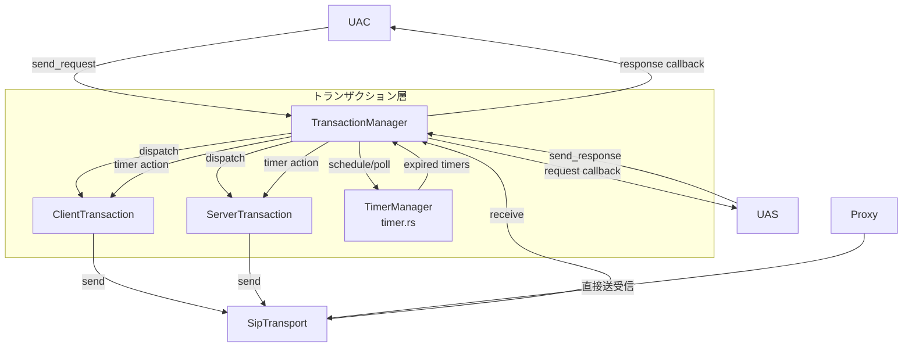

# SIPトランザクション層

## はじめに

SIP負荷試験ツール（UAC/UAS）にRFC 3261 Section 17準拠のSIPトランザクション層を実装しました。UDPパケットロス時の再送機能を提供し、高CPS環境でも信頼性の高いSIPメッセージ交換を実現します。プロキシはステートレスのまま維持し、トランザクション管理の対象外としています。

## アーキテクチャ

トランザクション層は、UAC/UASとトランスポート層の間に位置するミドルウェアとして機能します。

## 主要コンポーネント

トランザクション層は以下のファイルに分割されています:
- `transaction/mod.rs`: re-export、`TransactionId`、`Transaction` enum、`TransactionEvent`
- `transaction/helpers.rs`: `extract_branch`, `parse_method_from_cseq`, `generate_ack`
- `transaction/invite_client.rs`: `InviteClientState`, `InviteClientAction`, `InviteClientTransaction`
- `transaction/non_invite_client.rs`: `NonInviteClientState`, `NonInviteClientAction`, `NonInviteClientTransaction`
- `transaction/invite_server.rs`: `InviteServerState`, `InviteServerAction`, `InviteServerTransaction`
- `transaction/non_invite_server.rs`: `NonInviteServerState`, `NonInviteServerAction`, `NonInviteServerTransaction`
- `transaction/manager.rs`: `TransactionManager`
- `transaction/timer.rs`: `TimerConfig`

### TransactionId

Via headerのbranchパラメータとメソッドの組み合わせでトランザクションを一意に識別します。

### トランザクション種別

| 種別 | 状態遷移 | 用途 |
|------|---------|------|
| INVITEクライアント | Calling → Proceeding → Completed → Terminated | INVITE送信の再送制御 |
| Non-INVITEクライアント | Trying → Proceeding → Completed → Terminated | REGISTER/BYE送信の再送制御 |
| INVITEサーバー | Proceeding → Completed → Confirmed → Terminated | INVITEレスポンスの再送制御 |
| Non-INVITEサーバー | Trying → Proceeding → Completed → Terminated | REGISTER/BYEレスポンスの再送制御 |

### TimerManager

タイマー種別ごとの`VecDeque`キュー（10本）によるO(1)ティックコストのタイマー管理を実装。トランザクションごとに`tokio::spawn`せず、単一の`tokio::time::interval`ベースのティックループで管理します。

### タイマー一覧

| タイマー | 初期値 | 更新ルール | 用途 |
|---------|--------|-----------|------|
| Timer_A | T1 | 発火ごとに2倍 | INVITE再送間隔 |
| Timer_B | 64*T1 | 固定 | INVITEタイムアウト |
| Timer_D | max(32s, 64*T1) | 固定 | INVITE Completed待機 |
| Timer_E | T1 | min(2倍, T2) | Non-INVITE再送間隔 |
| Timer_F | 64*T1 | 固定 | Non-INVITEタイムアウト |
| Timer_G | T1 | min(2倍, T2) | INVITEサーバーレスポンス再送 |
| Timer_H | 64*T1 | 固定 | ACK待機タイムアウト |
| Timer_I | T4 | 固定 | Confirmed待機 |
| Timer_J | 64*T1 | 固定 | Non-INVITEサーバーCompleted待機 |
| Timer_K | T4 | 固定 | Non-INVITEクライアントCompleted待機 |

デフォルト値: T1=500ms, T2=4s, T4=5s（設定で変更可能）

### TransactionManager

`DashMap<TransactionId, Transaction>`ベースの並行管理。主要API:

- `send_request()`: クライアントトランザクション作成・送信
- `handle_response()`: レスポンスのディスパッチ
- `handle_request()`: サーバートランザクション作成・ディスパッチ
- `send_response()`: サーバートランザクション経由のレスポンス送信
- `tick()`: タイマーティック処理（再送・タイムアウト）

## 設定

`Config`構造体に以下のフィールドを追加:

| フィールド | 型 | デフォルト | 説明 |
|-----------|-----|----------|------|
| transaction_t1_ms | Option<u64> | 500 | T1 (ms) |
| transaction_t2_ms | Option<u64> | 4000 | T2 (ms) |
| transaction_t4_ms | Option<u64> | 5000 | T4 (ms) |
| max_transactions | Option<usize> | - | 最大トランザクション数 |

## 統計

`StatsCollector`に以下のカウンタを追加:

- `retransmissions`: 再送回数（クライアント+サーバー）
- `transaction_timeouts`: タイムアウト回数

## 正当性プロパティ

以下のプロパティをproptestで検証済み:

1. Transaction_IDラウンドトリップ
2. 異なるメソッドは異なるTransaction_ID
3. INVITEクライアントトランザクション状態遷移の正当性
4. Non-INVITEクライアントトランザクション状態遷移の正当性
5. INVITEサーバートランザクション状態遷移の正当性
6. Non-INVITEサーバートランザクション状態遷移の正当性
7. Terminated状態の不変性
8. 状態遷移の収束性（到達可能性）
9. タイマー派生値の正当性
10. Timer_A再送間隔の倍増
11. Timer_E再送間隔の上限
12. Timer_G再送間隔の上限
13. トランザクション上限の強制
14. リクエスト再受信の吸収
15. 再送・タイムアウト時の統計記録
